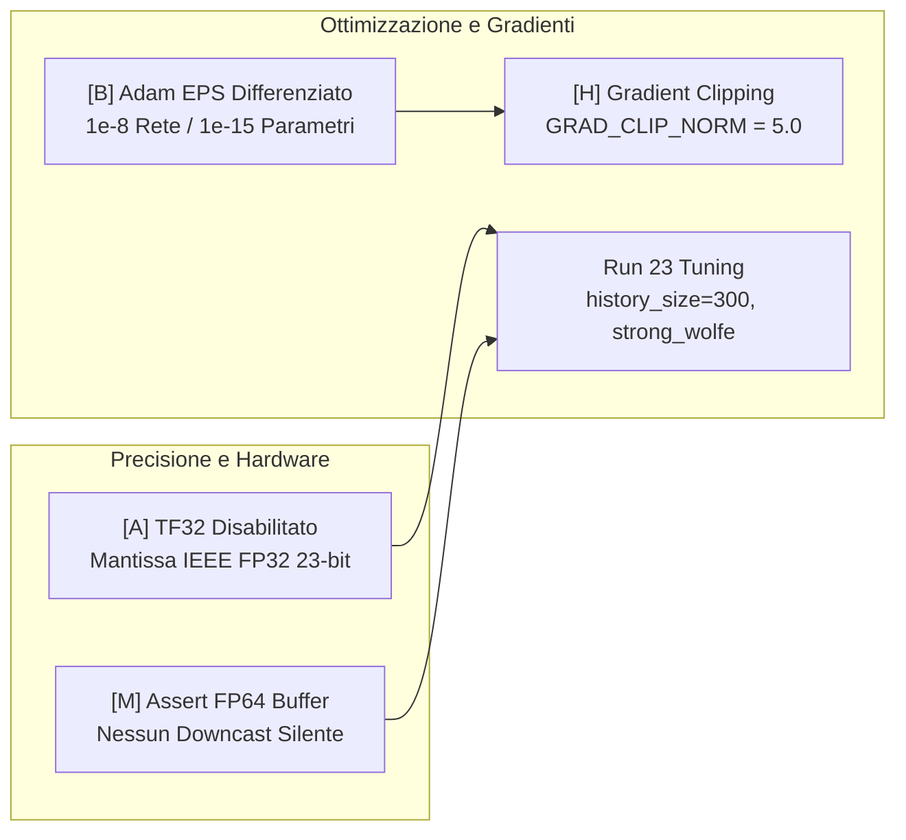
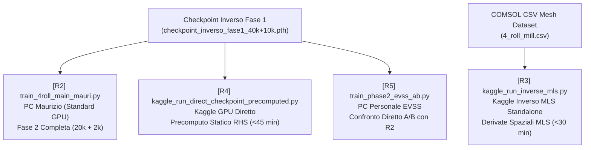

# Numerical Hygiene and Phase 2 Reforms

## Overview & Theoretical Background

Nelle Physics-Informed Neural Networks (PINNs) per flussi viscoelastici multifisici (Oldroyd-B, PTT, Giesekus), l'addestramento simultaneo congiunto (*coupled training*) di tutti i campi ($\psi, p, \boldsymbol{\tau}$) fallisce sistematicamente a causa della feroce competizione tra gradienti autograd di ordini differenti (primo ordine per convezione, secondo ordine per divergenza dello sforzo, terzo ordine per diffusione viscosa tramite $\psi$). Per superare questa patologia, il progetto adotta il framework disaccoppiato a due fasi (**[[Staged_Training_Procedure]]**):
1. **Fase 1 (Cinematica e Reologia)**: apprendimento della stream function $\psi$, del tensore degli sforzi polimerici $\boldsymbol{\tau}$, del tempo di rilassamento $\lambda$ e della viscosità polimerica $\mu_p$, mantenendo la pressione $p$ congelata e l'equazione di momento disattivata ($w_{mom}=0$).
2. **Fase 2 (Idrodinamica e Pressione)**: congelamento rigido del tensore $\boldsymbol{\tau}$ ricavato in Fase 1, ricostruzione del campo di pressione $p$ e identificazione della viscosità del solvente $\mu_s$ (o totale $\mu_{tot}$) con equazione di Navier-Stokes attiva ($w_{mom}=1$) e stream function $\psi$ mobile controllata con micro-learning rate per compensare la componente irrotazionale della velocità.

Tuttavia, le prime sperimentazioni della Fase 2 hanno evidenziato una serie di vulnerabilità numeriche e fisiche critiche:
- **Distruzione della Cinematica di Fase 1**: il residuo dimensionale dell'equazione di momento generava una loss nell'ordine di $O(10^5)$. Poiché la loss dati sulle velocità è normalizzata a $O(1)$, l'ottimizzatore forzava `model_psi` a distorcere la velocità appresa pur di minimizzare l'enorme residuo di Navier-Stokes.
- **Deriva di Gauge della Pressione (*Gauge Drift*)**: l'uso di una penalità quadratica puntuale di Dirichlet $W_{BC}(p(\mathbf{x}_0) - p_{ref})^2$ ha misura nulla nel dominio continuo, generando un autovalore infinitesimo ($\sim 1/N$) nella matrice Hessiana. Adam ignorava tale direzione, portando la costante di pressione a fluttuare casualmente.
- **Bias di Trasferimento $1:1$ e Viscosità Solvente Negativa ($\mu_s < 0$)**: nel fluido del 4-roll mill con rapporto $\mu_p / \mu_s = 0.9 / 0.1 = 9$, un errore residuo dell'1% su $\mu_{p,F1}$ induceva un errore del 9% su $\mu_s$, spingendo l'ottimizzatore in regioni non fisiche ($\mu_s \le 0$) e causando divergenza numerica.
- **Degradazione da Hardware TF32 e Stallo di Adam**: il troncamento hardware della mantissa a 10 bit sui Tensor Core NVIDIA Ampere/Ada introduceva un rumore numerico di fondo $\sim 10^{-3}$ nelle derivate terze di autograd, mentre l'$\epsilon$ standard di Adam ($10^{-8}$) congelava gli aggiornamenti degli scalari fisici.

Il pacchetto unificato di **Igiene Numerica e Riforme di Fase 2** (Proposte Claude [A], [B], [C], [H], [M], [AA], [AB], [AC], [AE] e tuning L-BFGS di Run 23) risolve in modo rigoroso e definitivo ciascuna di queste vulnerabilità.

---

## 1. Riforme di Igiene Numerica nel Core Codebase



### Proposta [A]: Disabilitazione TF32 e Preservazione Mantissa IEEE-754 a 23 bit
Nelle architetture GPU NVIDIA Ampere, Ada Lovelace e Hopper (RTX 30xx/40xx, A100, H100), TensorFloat-32 (TF32) è abilitato di default per moltiplicazioni di matrici (`matmul`) e convoluzioni (`cuDNN`). TF32 adotta lo stesso esponente a 8 bit di FP32 ma **tronca la mantissa da 23 bit a soli 10 bit**:
$$\epsilon_{\text{mach}}(\text{FP32}) = 2^{-24} \approx 5.96 \times 10^{-8}, \qquad \epsilon_{\text{mach}}(\text{TF32}) = 2^{-11} \approx 4.88 \times 10^{-4}$$
Nella formulazione basata su stream function $\psi$, i termini viscosi di Navier-Stokes $\mu_s \nabla^2 \mathbf{u}$ richiedono derivate terze rispetto alle coordinate spaziali:
$$\nabla^2 u = \frac{\partial^3 \psi}{\partial x^2 \partial y} + \frac{\partial^3 \psi}{\partial y^3}, \qquad \nabla^2 v = -\frac{\partial^3 \psi}{\partial x^3} - \frac{\partial^3 \psi}{\partial x \partial y^2}$$
Ogni passaggio di backward propaga le derivate attraverso 8 layer lineari con moltiplicazioni di matrici consecutive. Il troncamento a 10 bit si amplifica esponenzialmente lungo il grafo computazionale, creando un rumore di fondo statico nell'ordine di $10^{-3}$ che copre i veri gradienti fisici e impedisce la corretta convergenza dei parametri inversi.

**Implementazione nel core codebase** (`final_roll/src/train.py`, `train_4roll_main*.py`):
```python
# [Proposta A] Disabilitazione globale TF32 per preservare IEEE-754 FP32 (23-bit mantissa)
torch.backends.cuda.matmul.allow_tf32 = False
torch.backends.cudnn.allow_tf32 = False
torch.set_float32_matmul_precision("highest")
```

### Proposta [B]: Adam EPS Differenziato ($10^{-8}$ Rete, $10^{-15}$ Parametri Fisici)
La formula canonica di aggiornamento dell'ottimizzatore Adam è:
$$\theta_t = \theta_{t-1} - \eta \frac{\hat{m}_t}{\sqrt{\hat{v}_t} + \epsilon}$$
Per i parametri fisici scalari (es. $r \in \{r_\lambda, r_{\mu_p}, r_{\mu_s}, r_{\mu_{tot}}\}$ dove $\theta_{\text{phys}} = \theta_{\text{guess}} e^r$), il gradiente medio sul dominio $g_r = \partial \mathcal{L} / \partial r$ tende rapidamente a zero vicino all'ottimo, riducendo drasticamente il secondo momento non centrato $\hat{v}_t$.
Se $\epsilon = 10^{-8}$ (o il default PyTorch $10^{-7}$) e $\sqrt{\hat{v}_t} \ll \epsilon$, il denominatore si satura ad $\epsilon$, determinando una contrazione artificiale del passo:
$$\Delta r \approx -\eta \frac{\hat{m}_t}{\epsilon} \ll 1$$
Il parametro fisico si blocca in un plateau numerico fittizio (*false plateau*). Separando i gruppi di parametri dell'ottimizzatore, si assegna:
$$\epsilon_{\text{net}} = 10^{-8} \quad (\text{pesi e bias di rete}), \qquad \epsilon_{\text{phys}} = 10^{-15} \quad (\text{parametri scalari fisici})$$
In questo modo, $\sqrt{\hat{v}_t}$ rimane dominante rispetto a $\epsilon_{\text{phys}}$ fino alla precisione di macchina in FP64, consentendo allo scalare fisico di continuare a discendere liberamente il gradiente.

**Implementazione** (`final_roll/src/train.py`):
```python
ADAM_EPS = getattr(builtins, "ADAM_EPS", 1e-8)
ADAM_EPS_PHYS = getattr(builtins, "ADAM_EPS_PHYS", 1e-15)

net_params = [p for p in model.parameters() if p.requires_grad]
groups = [{"params": net_params, "lr": BASE_LR, "eps": ADAM_EPS}]

if physics.inverse_mode:
    phys_params = physics.get_phase2_params() if is_phase2 else [physics._raw_lam, physics._raw_mu_p]
    phys_params = [p for p in phys_params if p.requires_grad]
    if phys_params:
        groups.append({
            "params": phys_params,
            "lr": BASE_LR * PARAM_LR_FACTOR,
            "eps": ADAM_EPS_PHYS,
            "weight_decay": 0.0
        })

optimizer = torch.optim.Adam(groups, eps=ADAM_EPS)
```

### Proposta [H]: Gradient Clipping Rigido Standardizzato (`GRAD_CLIP_NORM = 5.0`)
Nel regime estensionale del four-roll mill, in prossimità dei rulli controrotanti e degli strati limite di taglio si possono verificare picchi localizzati di gradiente autograd con norme $\|\mathbf{g}\| > 200$. Con soglie di clipping permissive (precedentemente impostate a $1000.0$), i singoli passi di discesa possono proiettare i pesi della rete al di fuori del bacino di convergenza fisica.
La standardizzazione impone `GRAD_CLIP_NORM = 5.0` sui pesi neurali e `PARAM_CLIP_NORM = 1.0` sui parametri fisici in tutte le fasi di addestramento:
```python
GRAD_CLIP_NORM = 5.0
PARAM_CLIP_NORM = 1.0

torch.nn.utils.clip_grad_norm_(model.parameters(), GRAD_CLIP_NORM)
if physics.inverse_mode:
    phys_clip = [p for p in physics.parameters() if p.requires_grad]
    if phys_clip:
        torch.nn.utils.clip_grad_norm_(phys_clip, PARAM_CLIP_NORM)
```

### Proposta [M]: Assert Diagnostico Rigoroso Buffer & Dati FP64
Durante la transizione da Adam (FP32) a L-BFGS (FP64) prescritta dalla **[[Staged_Precision_Strategy]]**, se un qualsiasi buffer o tensore floating-point (es. `tau_scale`, `x_anchor`, `p_ref`, coordinate di collocazione) rimane non convertito in `torch.float64`, PyTorch retrocede silenziosamente (*silent downcasting*) il risultato dell'operazione matriciale a FP32. Ciò distrugge l'accuratezza del solver quasi-Newton a 64 bit pur consumando il doppio della memoria e del tempo di calcolo.
La funzione di conversione centralizzata `convert_to_fp64` integra ora `assert_fp64_integrity`, che scansiona ricorsivamente tutti i parametri, buffer e dizionari di dati:
```python
def assert_fp64_integrity(model, physics, data):
    """Verifica diagnostica rigida: nessun buffer, parametro o tensore dati deve essere in FP32."""
    for name, p in model.named_parameters():
        assert p.dtype == torch.float64, f"[FP64 GUARD] Parametro model '{name}' ha dtype {p.dtype}, atteso float64"
    for name, b in model.named_buffers():
        if b.is_floating_point():
            assert b.dtype == torch.float64, f"[FP64 GUARD] Buffer model '{name}' ha dtype {b.dtype}, atteso float64"
    for name, p in physics.named_parameters():
        assert p.dtype == torch.float64, f"[FP64 GUARD] Parametro physics '{name}' ha dtype {p.dtype}, atteso float64"
    for name, b in physics.named_buffers():
        if b.is_floating_point():
            assert b.dtype == torch.float64, f"[FP64 GUARD] Buffer physics '{name}' ha dtype {b.dtype}, atteso float64"
    
    def _check_dict(d, prefix="data"):
        for k, v in d.items():
            if isinstance(v, torch.Tensor) and v.is_floating_point():
                assert v.dtype == torch.float64, f"[FP64 GUARD] Tensore '{prefix}.{k}' ha dtype {v.dtype}, atteso float64"
            elif isinstance(v, dict):
                _check_dict(v, prefix=f"{prefix}.{k}")
    _check_dict(data)
```

---

## 2. Riforme di Formulazione Fisica e Architetturale

### Proposta [C]: Normalizzazione Tau per-componente ($\mathbf{s}_\tau = [s_{xx}, s_{xy}, s_{yy}]$)
Nel four-roll mill, l'azione di stiro estensionale al centro induce una netta anisotropia delle componenti del tensore degli sforzi:
$$\tau_{xx} \sim \frac{2\mu_p \dot{\varepsilon}}{1 - 2\lambda \dot{\varepsilon}}, \qquad \tau_{yy} \sim \frac{-2\mu_p \dot{\varepsilon}}{1 + 2\lambda \dot{\varepsilon}}, \qquad \tau_{xy} \sim \mu_p \dot{\gamma}$$
Mentre lo sforzo normale $\tau_{xx}$ cresce rapidamente avvicinandosi al coil-stretch limit ($\lambda \dot{\varepsilon} \to 0.5$), lo sforzo di taglio $\tau_{xy}$ rimane su scale inferiori. Uno scaling scalare unico $\tau_{\text{scale}} = \max(|\boldsymbol{\tau}|) \approx \max(|\tau_{xx}|)$ sovra-normalizza $\tau_{xy}$ e $\tau_{yy}$, riducendo il loro gradiente costitutivo di un ordine di grandezza e bloccando l'identificazione di $\lambda$.
Seguendo il principio di equilibrazione riga di Van der Sluis, si applicano tre fattori di scala indipendenti:
$$\mathbf{s}_\tau = \begin{bmatrix} s_{xx} \\ s_{xy} \\ s_{yy} \end{bmatrix} = \begin{bmatrix} \max(|\tau_{xx}|) \\ \max(|\tau_{xy}|) \\ \max(|\tau_{yy}|) \end{bmatrix}$$
registrati come buffer di forma `(1, 3)` in `CombinedModel` e applicati con broadcasting vettoriale su `model_tau(x) * self.tau_scale`. Nel calcolo dei residui costitutivi di Oldroyd-B, ciascuna equazione scalare è normalizzata per la rispettiva componente ($f_{\tau_{xx}}/s_{xx}$, $f_{\tau_{xy}}/s_{xy}$, $f_{\tau_{yy}}/s_{yy}$).

### Proposta [AA]: Adimensionalizzazione del Residuo di Momento ($\text{scale}_{mom} = \frac{\eta_0 U_{ref}}{H_{coord}^2} = 400.0\text{ Pa/m}$)
L'equazione stazionaria di bilancio della quantità di moto in 2D (Navier-Stokes) è:
$$\mathbf{R}_{\text{mom}} = \rho (\mathbf{u} \cdot \nabla)\mathbf{u} + \nabla p - \mu_s \nabla^2 \mathbf{u} - \nabla \cdot \boldsymbol{\tau} = \mathbf{0}$$
L'analisi dimensionale delle singole componenti rivela:
$$[\nabla p] = \frac{\text{Pa}}{\text{m}}, \qquad [\mu_s \nabla^2 \mathbf{u}] = (\text{Pa}\cdot\text{s})\frac{\text{m/s}}{\text{m}^2} = \frac{\text{Pa}}{\text{m}}, \qquad [\nabla \cdot \boldsymbol{\tau}] = \frac{\text{Pa}}{\text{m}}$$
La scala fisica caratteristica di variazione spaziale delle forze per unità di volume nel dominio del 4-roll mill ($H_{ref} = 0.05\text{ m}$, $U_{ref} = 1.0\text{ m/s}$, $\eta_0 = 1.0\text{ Pa}\cdot\text{s}$) è:
$$\text{scale}_{mom} = \frac{\eta_0 U_{ref}}{H_{ref}^2} = \frac{1.0 \times 1.0}{0.05^2} = 400.0 \text{ Pa/m}$$
Elevando al quadrato il residuo non scalato per la MSE loss:
$$\text{scale}_{mom}^2 = (400.0)^2 = 1.6 \times 10^5 \text{ Pa}^2/\text{m}^2$$
Nel codice non scalato, la loss del momento partiva da valori $\sim 1.6 \times 10^5$. Con un peso $W_{mom} = 1.0$, il residuo di momento pesava **$160.000$ volte più della loss sui dati di velocità** ($O(U^2) \sim 1$). Di conseguenza, l'ottimizzatore distruggeva la cinematica di Fase 1 nel tentativo disperato di azzerare il momento.

**Formulazione scalata**:
$$f_u^{\text{scaled}} = \frac{f_u}{\text{scale}_{mom}}, \qquad f_v^{\text{scaled}} = \frac{f_v}{\text{scale}_{mom}}$$
$$\mathcal{L}_{\text{mom}} = \frac{1}{2} \text{mean}\left( (f_u^{\text{scaled}})^2 + (f_v^{\text{scaled}})^2 \right) \in \mathcal{O}(10^{-2} - 10^0)$$
Ciò comprime la loss di un fattore $1.6 \times 10^5$, ristabilendo il perfetto bilanciamento asintotico tra momento e dati cinematici.

### Proposta [AB]: Ancoraggio Hard Algebrico della Pressione in `CombinedModel`
Nel problema idrodinamico incomprimibile con condizioni di velocità al contorno (senza trazioni imposte), la pressione è definita solo a meno di una costante additiva arbitraria:
$$\nabla(p(\mathbf{x}) + C) = \nabla p(\mathbf{x})$$
Nelle formulazioni tradizionali via soft penalty (**[[Pressure_Point_Anchoring]]**):
$$\mathcal{L}_{\text{anchor}} = W_{BC} (p(\mathbf{x}_0) - p_{ref})^2$$
Poiché $\mathbf{x}_0$ è un singolo punto discreto in un dominio continuo con migliaia di punti di collocazione, la sua proiezione nella matrice Hessiana possiede un autovalore $\lambda_{\text{min}} \sim 1/N$. Il gradiente di backpropagation associato a questo autovalore viene sommerso dal rumore stocastico di Adam, causando la deriva della costante di gauge (*gauge drift*).

L'**Ancoraggio Hard Algebrico** elimina il modo nullo direttamente nel grafo di forward della rete neurale:
$$\boxed{p(\mathbf{x}) = p_{\text{scale}} \cdot (\hat{p}(\mathbf{x}) - \hat{p}(\mathbf{x}_0)) + p_{\text{ref}}}$$
dove:
- $\hat{p}(\mathbf{x}) = \text{model\_p}(\mathbf{x}) \in \mathbb{R}$ è l'output adimensionale della rete;
- $\mathbf{x}_0$ è il tensore buffer registrato contenente le coordinate del punto di ancoraggio fisso (es. $[1.0, 1.0]$ nello spazio $[-1, 1]$);
- $p_{\text{ref}}$ è il valore scalare di pressione di riferimento nel punto $\mathbf{x}_0$;
- $p_{\text{scale}}$ è il fattore di scala globale della pressione ($p_{\text{scale}} \approx 50.0$).

**Proprietà matematiche**:
1. **Esattezza identica**: $p(\mathbf{x}_0) \equiv p_{\text{scale}}(\hat{p}(\mathbf{x}_0) - \hat{p}(\mathbf{x}_0)) + p_{\text{ref}} = 0 + p_{\text{ref}} \equiv p_{\text{ref}}$ con residuo esattamente pari a $0.0$ per qualsiasi peso $\theta_p$ e a qualsiasi epoca.
2. **Invarianza del gradiente**: $\nabla p(\mathbf{x}) = p_{\text{scale}} \nabla \hat{p}(\mathbf{x})$, poiché $\hat{p}(\mathbf{x}_0)$ è costante rispetto a $\mathbf{x}$.
3. **Eliminazione iperparametro**: la soft loss puntuale per `PressurePoint` in `physics.boundary_loss` viene completamente disattivata (`pass`), azzerando le instabilità di calibrazione dei pesi $W_{BC}$.

### Proposta [AC]: Riparametrizzazione in $\mu_{tot}$ e Barriera Softplus per $\mu_s$
Nel problema stazionario di Fase 2 con $\boldsymbol{\tau}$ congelato da Fase 1, sia $\boldsymbol{\tau}_{\text{froz}} = \boldsymbol{\tau}_{\text{true}} + \delta \boldsymbol{\tau}$ lo sforzo polimerico congelato. La componente di errore dominante di Fase 1 risiede nella parte newtoniana del polimero:
$$\delta \boldsymbol{\tau} \approx 2 \delta \mu_p \mathbf{D}$$
Sostituendo nel bilancio della quantità di moto e ricordando che $\nabla \cdot (2\mathbf{D}) = \Delta \mathbf{u}$:
$$\mathbf{R}_{\text{mom}} = \rho (\mathbf{u}\cdot\nabla)\mathbf{u} + \nabla p - (\mu_s + \delta \mu_p)\Delta \mathbf{u} - \nabla \cdot \boldsymbol{\tau}_{\text{true}}$$
Qualsiasi procedura di stima che minimizza il residuo di Navier-Stokes soddisfa l'accoppiamento:
$$\hat{\mu}_s = \mu_s^{\text{true}} - \delta \mu_p \iff \hat{\mu}_s + \hat{\mu}_{p,F1} = \mu_{tot}^{\text{true}}$$
Nel nostro fluido:
$$\mu_{tot}^{\text{true}} = 1.0 \text{ Pa}\cdot\text{s}, \qquad \mu_p^{\text{true}} = 0.9 \text{ Pa}\cdot\text{s}, \qquad \mu_s^{\text{true}} = 0.1 \text{ Pa}\cdot\text{s} \implies \frac{\mu_p}{\mu_s} = 9.0$$
Un piccolo errore dell'1% nella stima di $\mu_p$ in Fase 1 ($+0.009\text{ Pa}\cdot\text{s}$) produce un **errore del 9% su $\mu_s$** ($-0.009\text{ Pa}\cdot\text{s}$). Se Fase 1 sovrastima $\mu_p$ di oltre il 10%, l'ottimizzazione diretta di $\mu_s$ precipita verso valori negativi, provocando instabilità e crash numerico.

La soluzione consiste nel riparametrizzare l'inversione sulla **viscosità totale** $\mu_{tot}$, grandezza robustamente vincolata dalla dissipazione idrodinamica globale:
$$\mu_{tot} = \text{guess}\_\mu_{tot} \cdot \exp(r_{\mu_{tot}}), \qquad r_{\mu_{tot}} \in \mathbb{R}$$
La viscosità del solvente $\mu_s$ viene quindi derivata tramite la trasformazione softplus con parametro di acutezza $\beta = 20.0$:
$$\boxed{\mu_s = \text{softplus}(\mu_{tot} - \mu_{p,F1}, \beta=20.0) = \frac{1}{20} \ln\left(1 + e^{20(\mu_{tot} - \mu_{p,F1})}\right)}$$
**Vantaggi**:
1. **Positività rigorosa**: $\mu_s > 0$ per ogni valore reale di $r_{\mu_{tot}}$.
2. **Comportamento asintotico**: per $(\mu_{tot} - \mu_{p,F1}) > 0.05$, $\text{softplus}(x, 20) \to x$ con scarto inferiore a $10^{-4}$.
3. **Differenziabilità globale**: l'autograd propaga gradienti regolari lungo $\mu_{tot}$ senza discontinuità di clamping.

### Proposta [AE]: Diagnostica Preventiva di Hodge-Leray $\rho_{id}$ e CRLB
Decomponendo lo spazio $L^2(\Omega)^2$ nei sottospazi ortogonali solenoidale ($\mathcal{H}$) e dei gradienti ($\mathcal{G} = \{\nabla q\}$), l'equazione di Navier-Stokes si esprime come:
$$\mathbf{R} = \mathbf{b}(\mathbf{x}) + \nabla p - \mu_s \Delta \mathbf{u}$$
La rete neurale `model_p` approssima il sottospazio di dimensione finita $\mathcal{G}_M = \text{span}\{\nabla \phi_1, \dots, \nabla \phi_M\}$. Il vettore $\mathbf{a} = \Delta \mathbf{u} \in \mathbb{R}^{2N}$ rappresenta la colonna di sensitività per la viscosità del solvente $\mu_s$.
La proiezione di $\mathbf{a}$ su $\mathcal{G}_M$ è data da:
$$\mathbf{P}_{\mathcal{G}_M} \mathbf{a} = \Phi (\Phi^T \Phi + \lambda_{\text{tik}} I_M)^{-1} \Phi^T \mathbf{a}$$
dove $\Phi \in \mathbb{R}^{2N \times M}$ contiene i gradienti spaziali delle feature dell'ultimo layer trunk di `model_p`. La componente ortogonale residua (l'informazione che **non** può essere assorbita dal gradiente di pressione) è:
$$\mathbf{a}_\perp = \mathbf{a} - \mathbf{P}_{\mathcal{G}_M} \mathbf{a}$$
L'**Indice di Identificabilità di Hodge-Leray** è definito come:
$$\boxed{\rho_{id} = \frac{\|\mathbf{a}_\perp\|_{L^2}}{\|\mathbf{a}\|_{L^2}} = \sqrt{\frac{\sum_i a_{\perp, i}^2}{\sum_i a_i^2 + 10^{-30}}} \in [0, 1]}$$
L'Informazione Efficace di Fisher e il Cramér-Rao Lower Bound (CRLB) sono:
$$\mathcal{I}_{\text{eff}}(\mu_s) = \frac{\|\mathbf{a}_\perp\|^2}{\sigma^2}, \qquad \text{sd}(\hat{\mu}_s) \ge \frac{\sigma}{\|\mathbf{a}_\perp\|} = \frac{\sigma}{\rho_{id} \|\Delta \mathbf{u}\|}$$

| Range $\rho_{id}$ | Stato di Identificabilità Fisica | Strategia Operativa di Training |
|:---:|---|---|
| $\rho_{id} \ge 0.20$ | **Ben Identificato** | Procedere regolarmente con Fase 2 (Adam + L-BFGS). |
| $0.02 \le \rho_{id} < 0.20$ | **Marginale / Mal Condizionato** | Richiede FP64, `history_size=300`, e parametrizzazione $\mu_{tot}$ softplus. |
| $\rho_{id} < 0.02$ | **Non Identificabile Strutturalmente** | $\mu_s$ assorbito dal gauge di pressione; necessario vincolo di coppia/trazione sui rulli. |

Nel four-roll mill analizzato a inizio Fase 2, la diagnostica restituisce $\rho_{id} \approx 0.999$, confermando l'eccellente separabilità fisica del campo di velocità rispetto allo span dei gradienti di pressione.

---

## 3. Motore di Ottimizzazione: Tuning L-BFGS di Run 23

Il passaggio alla seconda parte di Fase 2 prevede l'ottimizzatore quasi-Newton L-BFGS in doppia precisione (FP64). Sulla base delle risultanze empiriche di Run 22 e Run 23, la configurazione ottimale è:
```python
optimizer_lbfgs = torch.optim.LBFGS(
    params,
    lr=1.0,
    max_iter=1,                   # Step-by-step per monitoraggio esterno
    max_eval=20,
    history_size=300,             # [Run 23] Incrementato da 50 a 300 per curvatura di Poisson
    tolerance_grad=1e-16,         # Azzerato per prevenire arresto precoce in FP64
    tolerance_change=1e-16,       # Azzerato per prevenire arresto precoce in FP64
    line_search_fn="strong_wolfe" # Rispetta le condizioni di curvatura di Armijo-Goldstein
)
```
- **`history_size = 300`**: l'operatore di Poisson della pressione ha raggio d'azione non locale a scala di dominio; una history corta (50-100) tronca i modi spaziali a bassa frequenza, rallentando la convergenza globale.
- **Tolleranze $10^{-16}$**: il default PyTorch (`tolerance_grad=1e-7`) innescava l'arresto prematuro già alla prima iterazione L-BFGS in FP64 appena il gradiente scendeva sotto $10^{-7}$.
- **`strong_wolfe`**: assicura la stabilità asintotica della matrice Hessiana inversa approssimata $B_k^{-1}$.

---

## 4. Architettura della Suite di Script per Fase 2

Per validare e confrontare in parallelo le differenti formulazioni su cluster eterogenei (PC Maurizio, Kaggle, PC Personale), è stata sviluppata una suite di 4 script dedicati:



### [R2] Script Standard per PC Maurizio (`final_roll/train_4roll_main_mauri.py`)
- **Ruolo**: Script primario di produzione per validazione remota su workstation con GPU CUDA.
- **Flusso**:
  1. Caricamento pesi dal checkpoint di Fase 1 `checkpoint_inverso_fase1_40k+10k.pth`.
  2. Inizializzazione `CombinedModel` con `tau_scale` vettoriale `(1, 3)` e ancoraggio hard $p(\mathbf{x}_0) = p_{ref}$.
  3. Diagnostica preventiva di identificabilità di Hodge-Leray $\rho_{id}$.
  4. Fase 2 Adam (20.000 epoche): `model_psi` mobile controllato (`lr = 1e-4`), `model_p` mobile (`lr = 1e-3`), `_raw_mu_tot` mobile (`lr = 1e-4`, `eps = 1e-15`), `model_tau` rigidamente congelato.
  5. Transizione a FP64 con guard buffer `assert_fp64_integrity`.
  6. Fase 2 L-BFGS (2.000 iterazioni): `history_size = 300`, `strong_wolfe`, `tolerance = 1e-16`.

### [R3] Script Kaggle Inverso Standalone MLS (`scratch/kaggle_run_inverse_mls.py`)
- **Ruolo**: Verifica isolata della determinabilità di $\mu_s$ e $p$ senza alcuna interferenza o errore di approssimazione dalle reti neurali cinematiche.
- **Formulazione**:
  - Nessuna rete neurale per $\psi$ o per $\boldsymbol{\tau}$.
  - Calcolo delle derivate spaziali COMSOL di secondo grado mediante Moving Least Squares (MLS) con coordinate centrate e scalate $[-1, 1]$ su supporto locale ($K=25$ vicini).
  - Addestramento esclusivo di `model_p` (con ancoraggio hard) e identificazione diretta di $\mu_s$ sul residuo di Navier-Stokes.
  - Runtime: $<30$ minuti su GPU Kaggle T4.

### [R4] Script Kaggle Diretto con Precomputo RHS (`scratch/kaggle_run_direct_checkpoint_precomputed.py`)
- **Ruolo**: Soluzione ultra-rapida del problema diretto della sola pressione partendo dalla cinematica e dallo stress identificati in Fase 1.
- **Innovazione**:
  - Nel problema diretto a cinematica congelata, il termine forzante di Navier-Stokes è statico:
    $$\mathbf{g}_{F1}(\mathbf{x}) = -\rho (\mathbf{u}_{F1} \cdot \nabla)\mathbf{u}_{F1} + \mu_s^{\text{true}} \Delta \mathbf{u}_{F1} + \nabla \cdot \boldsymbol{\tau}_{F1}$$
  - $\mathbf{g}_{F1}$ viene calcolato **una sola volta prima del loop di training** sui punti di collocazione.
  - Il loop di addestramento valuta semplicemente $\mathcal{L} = \frac{1}{2} \| (\nabla p_\theta - \mathbf{g}_{F1}) / \text{scale}_{mom} \|^2$.
  - Elimina tutti i calcoli di autograd di 2° e 3° ordine su $\psi$ e $\boldsymbol{\tau}$ ad ogni epoca, abbattendo il tempo da 26 ore a **meno di 45 minuti** ($<0.2$ s/epoca).

### [R5] Script EVSS per PC Personale (`scratch/train_phase2_evss_ab.py`)
- **Ruolo**: Confronto A/B controllato contro lo standard di Maurizio per valutare l'Elastic-Viscous Split Stress (EVSS).
- **Formulazione**:
  - Tensione elastica modificata: $\boldsymbol{\Sigma} = \boldsymbol{\tau} - 2\mu_p \mathbf{D} \implies \nabla \cdot \boldsymbol{\Sigma} = \nabla \cdot \boldsymbol{\tau} - \mu_p \Delta \mathbf{u}$.
  - Equazione di Navier-Stokes espressa con la viscosità totale $\mu_{tot}$:
    $$\mathbf{R}_{\text{EVSS}} = \rho(\mathbf{u}\cdot\nabla)\mathbf{u} + \nabla p - \mu_{tot} \Delta \mathbf{u} - \nabla \cdot \boldsymbol{\Sigma}_{F1} = \mathbf{0}$$
  - Punti di collocazione, semi casuali, budget di epoche (20k + 2k) e parametri iniziali identici a R2 per consentire un confronto metrico rigoroso.

---

## References & Back-links

- **Topics Correlati**:
  - [[Pressure_Stress_Decoupling]] — Fondamenti analitici del disaccoppiamento pressione-stress.
  - [[Viscoelasticity]] — Equazioni costitutive di Oldroyd-B e numeri adimensionali ($Re, Wi$).
  - [[Viscoelastic_Parameter_Identifiability]] — Analisi di sensitività e limiti di identificabilità inversa.
- **Methods Correlati**:
  - [[Staged_Training_Procedure]] — Workflow a due fasi sequenziali cinematica/idrodinamica.
  - [[Staged_Precision_Strategy]] — Protocollo di transizione FP32 (Adam) $\to$ FP64 (L-BFGS).
  - [[Pressure_Point_Anchoring]] — Meccanismo storico di ancoraggio della pressione e fallback su mesh COMSOL.
  - [[MLS_Derivatives_Pressure]] — Stima di derivate spaziali con Moving Least Squares scalate $[-1, 1]$.
  - [[Soft_Anti_Drift]] — Regolarizzazione cinematica della stream function $\psi$.
  - [[ViscoelasticNet]] — Architettura multi-head con stream function formulation.
- **Sistemi Fisici & Indice Generale**:
  - [[Viscoelastic_Fluids]] — Benchmark e fisica del four-roll mill.
  - [[00_Index]] — Indice generale della PINN-Wiki.
