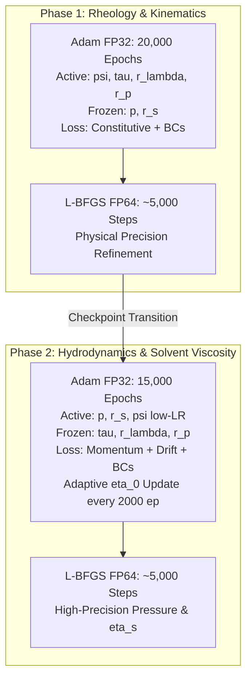

# Method: Staged Training Procedure

## Overview
The **Staged Training Procedure** (also known as Decoupled Training) is a multi-phase optimization framework designed for multi-field physics in Viscoelastic PINNs. By isolating the kinematic/rheological learning from the hydrodynamic pressure balance, it eliminates severe gradient competition and enables robust inverse parameter identification ($\lambda, \eta_p, \eta_s$).

---

## Two-Phase Decoupled Architecture

The optimization pipeline is structured into two sequential, decoupled phases. Global coupled optimization (unfreezing all networks simultaneously) is **strictly deprecated** because joint momentum-constitutive training degrades the discovered stress topology.

---

### Phase 1: Kinematics & Rheology (Stress & Constitutive Discovery)
- **Active Networks**: `model_psi`, `model_tau`
- **Frozen Networks**: `model_p` (explicitly zeroed / frozen)
- **Active Trainable Parameters**:
  - Relaxation time $\lambda$ and polymeric viscosity $\eta_p$ (in log-space: $r_\lambda, r_{\eta_p}$).
  - Non-linear constitutive parameters: Giesekus mobility $\alpha \in [0, 0.5]$ (via sigmoid) and PTT extensibility $\varepsilon \ge 0$ (via softplus), with unbiased initial guesses $\alpha_{\text{guess}} = 0.25, \varepsilon_{\text{guess}} = 0.25$ (see [[ViscoelasticNet_Full model]]).
- **Frozen Parameters**: $\eta_s$ (solvent viscosity deferred to Phase 2)
- **Active Loss Functions**:
  - Unified Constitutive PDE residual (Oldroyd-B / PTT / Giesekus):
    $$ f_{\text{PTT}}(\boldsymbol{\tau}) \boldsymbol{\tau} + Wi \overset{\triangledown}{\boldsymbol{\tau}} + \frac{\alpha Wi}{\tilde{\eta}_p} \boldsymbol{\tau}^2 - 2 \tilde{\eta}_p \mathbf{D} = \mathbf{0} $$
  - Boundary conditions: Velocity Dirichlet $\mathbf{u}_{\text{bc}}$ and roll stress Dirichlet $\boldsymbol{\tau}_{\text{roll}}$ (when `USE_ROLL_STRESS_BC = True`)
  - Momentum Loss: **OFF** ($w_{\text{mom}} = 0.0$)
- **Numerical Precision Schedule**:
  1. **Adam @ FP32** (with synchronized [[Cosine_Annealing_LR]] from $\eta_{\max} = 2.5 \times 10^{-3}$ to $\eta_{\min} = 2.5 \times 10^{-6}$ coupling neural networks and physical parameters via $\text{PARAM\_LR\_FACTOR} = 1.0$).
  2. **L-BFGS @ FP64** (~5,000 steps) for high-precision convergence of all physical parameters and stress field topology.
- **Outcome**: Recovers stream function $\psi$ and extra-stress tensor $\boldsymbol{\tau}$ while identifying constitutive model parameters without interference from hydrodynamic pressure balance.

---

### Phase 2: Hydrodynamics & Pressure Field Reconstruction
> [!NOTE]
> **Scopo Fisico di Fase 2 alla Luce della Non-Identificabilità di $\eta_s$**:
> Come dimostrato formalmente in **[[Solvent_Viscosity_Non_Identifiability]]**, la viscosità del solvente $\eta_s$ non è identificabile da dati cinematici/tensoriali nel Four-Roll Mill. La Fase 2 opera pertanto primariamente come **solutore differenziale idrodinamico per il campo di pressione $p(x,y)$** impostando la viscosità del solvente $\eta_s$ (o totale $\eta_{\text{tot}}$) al valore noto di riferimento, evitando che l'ottimizzatore vaghi lungo la varietà degenere di Navier-Stokes.

- **Active Networks**:
  - `model_p`: Primary active network ($LR_p = 10^{-3}$) with algebraic [[Pressure_Point_Anchoring]]
  - `model_psi`: **Crucially mobile** with low learning rate ($LR_\psi = 10^{-4}$) and [[Soft_Anti_Drift]] to resolve the [[Pressure_Stress_Decoupling#The Helmholtz-Hodge Pressure Inference Limit|Helmholtz-Hodge limit]]. (`model_psi` is **never frozen** in Phase 2).
- **Frozen Networks**: `model_tau` (frozen rigidly from Phase 1 checkpoint, enabling static precomputation of $\nabla \cdot \boldsymbol{\tau}$)
- **Parameters**: Solvent viscosity $\eta_s$ (fissata al valore nominale, o ottimizzata unicamente in presenza di dati di coppia o pressione differenziale)
- **Frozen Parameters**: $\lambda, \eta_p, \alpha, \varepsilon$ (frozen to prevent constitutive corruption)
- **Active Loss Functions**:
  - Direct Momentum PDE: $Re_{\text{scale}} (\mathbf{u} \cdot \nabla \mathbf{u}) + \nabla p - \tilde{\eta}_s \nabla^2 \mathbf{u} - \nabla \cdot \boldsymbol{\tau} = 0$
  - Kinematic regularization: [[Soft_Anti_Drift]] loss $\mathcal{L}_{\text{drift}}$
  - Pressure Gauge Hard Anchoring: enforced algebrically inside `CombinedModel.pressure(x)` ($p(\mathbf{x}) = p_{\text{scale}}(p_{\text{raw}}(\mathbf{x}) - p_{\text{raw}}(\mathbf{x}_0)) + p_{\text{ref}}$ via [[Pressure_Point_Anchoring]]), satisfying $p(\mathbf{x}_0) \equiv p_{\text{ref}}$ identically and eliminating soft penalty losses
  - Velocity BCs on domain boundaries
- **Adaptive Scaling**: Periodic block-wise update of scaling viscosity $\eta_0$ every $K=2000$ epochs via [[Adaptive_Nondimensionalization]].
- **Numerical Precision Schedule**:
  1. Adam @ FP32 (15,000 epochs).
  2. L-BFGS @ FP64 (~5,000 steps) for final convergence of pressure.

---

## Deprecation Notice: Phase 3 Joint Training

> [!WARNING]
> **Phase 3 Joint Coupled Optimization is Deprecated**
> Early PINN literature advocated unfreezing all networks simultaneously in a third phase. In viscoelastic flows, this joint optimization allows hydrodynamic momentum residuals to propagate gradients into `model_tau`, overriding the well-conditioned constitutive loss and corrupting the spatial stress distribution. The modern standard restricts training strictly to the 2-Phase staged framework.

---

## Logarithmic Parameter Space Formulation

To avoid gradient vanishing and negative parameter values, all physical parameters are optimized in logarithmic coordinates:
$$\lambda = \lambda_{\text{ref}} e^{r_\lambda}, \qquad \eta_p = \eta_{p,\text{ref}} e^{r_p}, \qquad \eta_s = \eta_{s,\text{ref}} e^{r_s}$$
- Guaranteed positivity: $\forall r \in \mathbb{R}, \ e^r > 0$.
- Eliminates numerical scaling disparities between large and small viscosities.
- Preserves full blind training by setting $\lambda_{\text{ref}}, \eta_{p,\text{ref}}, \eta_{s,\text{ref}}$ to arbitrary unit factors without encoding material priors.

---

## Related Concepts
- **Methods**: [[Soft_Anti_Drift]], [[Adaptive_Nondimensionalization]], [[Staged_Precision_Strategy]], [[ViscoelasticNet]]
- **Topics**: [[Solvent_Viscosity_Non_Identifiability]], [[Viscoelastic_Parameter_Identifiability]], [[Pressure_Stress_Decoupling]], [[Nondimensionalization]]
- **Systems**: [[Viscoelastic_Training]]
