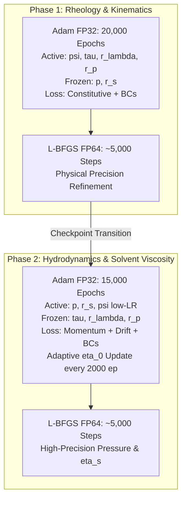

# Method: Staged Training Procedure

## Overview
The **Staged Training Procedure** (also known as Decoupled Training) is a multi-phase optimization framework designed for multi-field physics in Viscoelastic PINNs. By isolating the kinematic/rheological learning from the hydrodynamic pressure balance, it eliminates severe gradient competition and enables robust inverse parameter identification ($\lambda, \eta_p, \eta_s$).

---

## Two-Phase Decoupled Architecture

The optimization pipeline is structured into two sequential, decoupled phases. Global coupled optimization (unfreezing all networks simultaneously) is **strictly deprecated** because joint momentum-constitutive training degrades the discovered stress topology.

---

### Phase 1: Kinematics & Rheology (Stress Discovery)
- **Active Networks**: `model_psi`, `model_tau`
- **Frozen Networks**: `model_p` (explicitly zeroed / frozen)
- **Active Trainable Parameters**: $\lambda, \eta_p$ (in log-space: $r_\lambda, r_p$)
- **Frozen Parameters**: $\eta_s$ (parameter $r_s$ frozen)
- **Active Loss Functions**:
  - Constitutive PDE residual: $\boldsymbol{\tau}^* + Wi \overset{\triangledown}{\boldsymbol{\tau}^*} - 2 \tilde{\eta}_p \mathbf{D}^* = 0$
  - Boundary conditions: Velocity Dirichlet $\mathbf{u}_{\text{bc}}$ and roll stress Dirichlet $\boldsymbol{\tau}_{\text{roll}}$
  - Momentum Loss: **OFF** ($w_{\text{mom}} = 0.0$)
- **Numerical Precision Schedule**:
  1. Adam @ FP32 (20,000 epochs) for broad landscape exploration.
  2. L-BFGS @ FP64 (~5,000 steps) for high-precision convergence of $\lambda$ and $\eta_p$.
- **Outcome**: Recovers stream function $\psi$ and polymeric extra-stress $\boldsymbol{\tau}$ with high physical fidelity ($\lambda$ and $\eta_p$ converged to $<1.5\%$ error in tests).

---

### Phase 2: Hydrodynamics & Solvent Viscosity (Pressure & $\eta_s$)
- **Active Networks**:
  - `model_p`: Primary active network ($LR_p = 10^{-3}$)
  - `model_psi`: Unlocked with low learning rate ($LR_\psi = 10^{-4}$) to resolve the [[Pressure_Stress_Decoupling#The Helmholtz-Hodge Pressure Inference Limit|Helmholtz-Hodge limit]]
- **Frozen Networks**: `model_tau` (frozen from Phase 1 checkpoint)
- **Active Trainable Parameters**: $\eta_s$ ($LR_{\eta_s} = 10^{-4}$ in log-space)
- **Frozen Parameters**: $\lambda, \eta_p$ (frozen to prevent constitutive corruption)
- **Active Loss Functions**:
  - Direct Momentum PDE: $Re_{\text{scale}} (\mathbf{u} \cdot \nabla \mathbf{u}) + \nabla p - \tilde{\eta}_s \nabla^2 \mathbf{u} - \nabla \cdot \boldsymbol{\tau} = 0$
  - Kinematic regularization: [[Soft_Anti_Drift]] loss $\mathcal{L}_{\text{drift}}$
  - Pressure Gauge Anchor: $\mathcal{L}_{p,\text{anchor}}$ at reference point $p(x_0, y_0) = 0$
  - Velocity BCs on domain boundaries
- **Adaptive Scaling**: Periodic block-wise update of scaling viscosity $\eta_0$ every $K=2000$ epochs via [[Adaptive_Nondimensionalization]].
- **Numerical Precision Schedule**:
  1. Adam @ FP32 (15,000 epochs).
  2. L-BFGS @ FP64 (~5,000 steps) for final convergence of pressure and $\eta_s$.

---

## Deprecation Notice: Phase 3 Joint Training

> [!WARNING]
> **Phase 3 Joint Coupled Optimization is Deprecated**
> Early PINN literature advocated unfreezing all networks simultaneously in a third phase. In viscoelastic flows, this joint optimization allows hydrodynamic momentum residuals to propagate gradients into `model_tau`, overriding the well-conditioned constitutive loss and corrupting the spatial stress distribution. The modern standard restricts training strictly to the 2-Phase staged framework.

---

## Logarithmic Parameter Space Formulation

To avoid gradient vanishing and negative parameter values, all physical parameters are optimized in logarithmic coordinates:
$$\lambda = \lambda_{\text{ref}} e^{r_\lambda}, \qquad \eta_p = \eta_{p,\text{ref}} e^{r_p}, \qquad \eta_s = \eta_{s,\text{ref}} e^{r_s}$$
- Guaranteed positivity: $\forall r \in \mathbb{R}, \ e^r > 0$.
- Eliminates numerical scaling disparities between large and small viscosities.
- Preserves full blind training by setting $\lambda_{\text{ref}}, \eta_{p,\text{ref}}, \eta_{s,\text{ref}}$ to arbitrary unit factors without encoding material priors.

---

## Related Concepts
- **Methods**: [[Soft_Anti_Drift]], [[Adaptive_Nondimensionalization]], [[Staged_Precision_Strategy]], [[ViscoelasticNet]]
- **Topics**: [[Viscoelastic_Parameter_Identifiability]], [[Pressure_Stress_Decoupling]], [[Nondimensionalization]]
- **Systems**: [[Viscoelastic_Training]]
