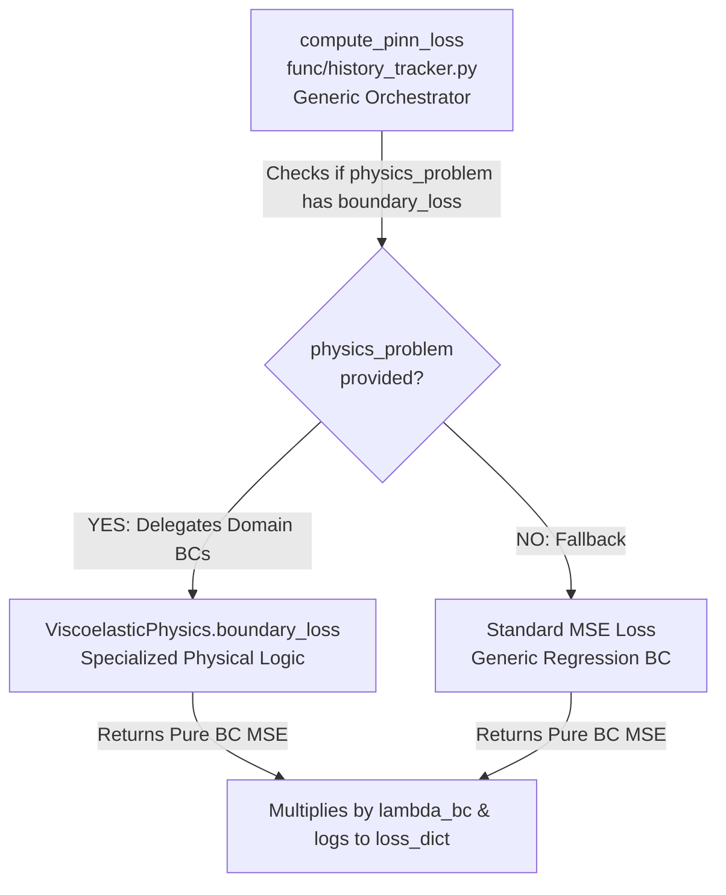
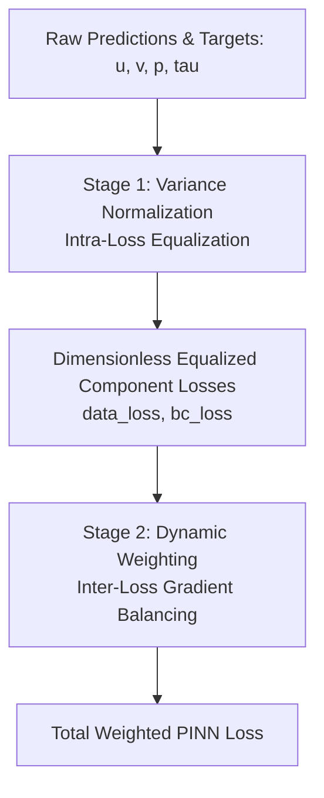

# System: Viscoelastic Training Experiment

## Overview
This document serves as the comprehensive technical and architectural specification for the Viscoelastic PINN training pipeline implemented in `Viscoelastic_main.py` and `Viscoelastic/src/Viscoelastic_PINN.py`. While [[Viscoelastic_Fluids]] covers the physical governing equations (Navier-Stokes and Oldroyd-B), this guide details the neural network architectures, training orchestration, boundary condition implementation, and hyperparameter configurations.

## Neural Network Architectures
The training pipeline decouples the discovery of the physical fields using a multi-network architecture unified by `ViscoelasticCombinedModel`, as conceptualized in [[ViscoelasticNet]]:

### 1. Sub-Network Definitions
- **Stream Function (`model_psi`)**: An [[FCN]] taking $(x,y)$ and outputting scalar $\psi$. Velocity components are derived via autograd: $u = \partial\psi/\partial y, v = -\partial\psi/\partial x$. This guarantees a divergence-free velocity field ($\nabla \cdot \mathbf{u} = 0$) by construction.
- **Pressure (`model_p`)**: An [[FCN]] outputting scalar $p$.
- **Polymeric Stress (`model_tau`)**: An [[FCN]] outputting 3 stress components: $(\tau_{xx}, \tau_{xy}, \tau_{yy})$.

### 2. Architectural Design Choices
- **Tapered Layers**: Funnel-style layer configurations (e.g., `[2, 120, 100, 80, 60, 40, 20, 1]` for scalar outputs and `[2, 120, 100, 80, 60, 40, 20, 3]` for stress) are used to condense features hierarchically (see [[Tapered_Architectures]]).
- **Activation Function**: `nn.SiLU` ([[Activation_Functions]]) is selected as the standard activation due to its smooth second derivatives, which are essential for calculating stable Laplacian terms in Navier-Stokes.
- **Explicit Zero Initialization**: To prevent initial random noise from destabilizing early kinematic learning, the final linear layers (weights and biases) of `model_tau` and `model_p` are explicitly initialized to zero via `initialize_last_layer_zero()`.
- **Velocity Inference Wrapper**: A utility module `VelocityInferenceWrapper` is used during evaluation to extract $u(x,y)$ cleanly for validation metrics and plotting.

## Staged Training Orchestration
To overcome the severe gradient competition between smooth kinematic variables and highly non-linear stress fields, the pipeline employs a 3-phase decoupled training strategy. For the overarching theoretical framework, see [[Staged_Training_Procedure]].

```mermaid
graph TD
    A[Phase 1: Kinematics & Rheology<br>Adam FP32 - 50% Epochs<br>Active: psi, tau, mu_p, lam | Frozen: p, mu_s<br>BCs: u, v, txx, txy, tyy] --> B[Phase 2: Dynamics<br>Adam FP32 - 50% Epochs<br>Active: psi, p, mu_s | Frozen: tau, mu_p, lam<br>BCs: u, v, p]
    B --> C[Phase 3: Full Coupled Refinement<br>L-BFGS FP64<br>Active: All psi, p, tau, mu_s, mu_p, lam<br>BCs: All 6 fields]
```

### Phase 1: Kinematics & Rheology (Adam - First 50% Epochs)
- **Active Networks**: `model_psi`, `model_tau` (`set_model_trainable(model, ['psi', 'tau'])`)
- **Frozen Networks**: `model_p`
- **Active PDE Losses**: `constitutive` (Oldroyd-B ON), `momentum: 0.0` (Navier-Stokes OFF).
- **Active Boundary Conditions**: `current_active_bcs = ['u', 'v', 'txx', 'txy', 'tyy']` (Pressure BCs excluded).
- **Inverse Problem (Physical Parameters)**: Active training of rheological parameters $\mu_p$ (polymer viscosity) and $\lambda$ (relaxation time) alongside the stress network. $\mu_s$ (solvent viscosity) is frozen.
- **Physical Objective**: Learn the stream function $\psi$ (velocity profile) from boundary/internal data while simultaneously discovering the corresponding polymeric stress field $\boldsymbol{\tau}$ via the Oldroyd-B constitutive laws, completely isolated from pressure fluctuations.

### Phase 2: Dynamics (Adam - Second 50% Epochs)
- **Active Networks**: `model_psi`, `model_p` (`set_model_trainable(model, ['psi', 'p'])`)
- **Frozen Networks**: `model_tau`
- **Active PDE Losses**: `momentum` ON, `constitutive` ON (All PDEs active).
- **Active Boundary Conditions**: `current_active_bcs = ['u', 'v', 'p']` (Stress BCs excluded).
- **Inverse Problem (Physical Parameters)**: Active training of dynamic parameter $\mu_s$ (solvent viscosity) alongside the pressure network. Rheological parameters $\mu_p$ and $\lambda$ are frozen to prevent distortion against the frozen stress network.
- **Physical Objective**: Freeze the discovered stress field and learn the pressure distribution $p(x,y)$ required to balance the Navier-Stokes momentum equations.

### Phase 3: Full Coupled Refinement (L-BFGS)
- **Active Networks**: **All Networks** (`psi`, `p`, `tau` fully unfrozen).
- **Precision Mode**: Switches to **FP64** (`torch.float64`) for scientific-grade precision (see [[Staged_Precision_Strategy]]).
- **Active PDE & BCs**: All PDE residuals and all 6 boundary conditions (`u, v, p, txx, txy, tyy`) are active (`current_active_bcs = None`).
- **Inverse Problem (Physical Parameters)**: All 3 physical parameters ($\mu_s, \mu_p, \lambda$) are fully unfrozen for joint high-precision refinement.
- **Physical Objective**: Perform joint full-batch optimization using L-BFGS (`max_iters=100`) to achieve global physical consistency across all coupled equations.

## Boundary Conditions & Exact Geometric Slicing (Debugging Guide)
The generation of boundary coordinates (`generate_boundaries` in `Viscoelastic_physics.py`) implements rigorous geometric slicing (**Proposta 1**) to prevent numerical artifacts during mini-batch sampling.

### 1. The Corner Duplication Pitfall (Historical Mechanism)
Previously, naive `torch.linspace` calls across full boundary lengths resulted in the 4 corner vertices $(0,0), (0,L_y), (L_x,0), (L_x,L_y)$ appearing **twice** in `xy_boundary`. This caused:
- **Sampling Imbalance**: Corners had twice the probability of being sampled in `_sample_minibatch`.
- **Gradient Fighting (Physical Conflict)**: Duplicate corner points belonged to different boundary segments with conflicting normal vectors and targets. At inlet corners $(0,0)$ and $(0,L_y)$, Inlet Dirichlet targets ($\tau=\tau_{\text{exact}}$) clashed directly with Wall Neumann targets ($\partial\tau/\partial y = 0$), causing severe local oscillations.

### 2. Rigorous Geometric Slicing (Current Implementation)
To enforce a strict physical hierarchy, the boundary generation logic slices tensors explicitly:
```python
# 1. Inlet (x=0): Governs full y in [0, Ly] -> Ny points (owns (0,0) and (0,Ly))
y_inlet = torch.linspace(0, Ly, Ny)

# 2. Walls (y=0, Ly): Govern x in (0, Lx] -> Nx-1 points (excludes x=0, owns (Lx,0) and (Lx,Ly))
x_wall = torch.linspace(0, Lx, Nx)[1:]

# 3. Outlet (x=Lx): Governs y in (0, Ly) -> Ny-2 points (excludes y=0 and y=Ly)
y_outlet = torch.linspace(0, Ly, Ny)[1:-1]
```
- **Exact Perimeter Count**: The total boundary points generated match the exact discrete perimeter of an $N_x \times N_y$ grid:
  $$N_{\text{boundary}} = N_y + 2(N_x - 1) + (N_y - 2) = 2N_x + 2N_y - 4$$
  Every boundary point appears exactly once, ensuring perfectly balanced stochastic mini-batch sampling and eliminating gradient fighting.

### 3. Boundary Loss Architectural Design (Orchestrator vs. Domain Delegation)
A common architectural question when inspecting the codebase is why boundary loss computation appears in both the shared utility `func/history_tracker.py` (`compute_pinn_loss`) and the domain-specific physics module `Viscoelastic/src/Viscoelastic_physics.py` (`boundary_loss`). **This is not a duplication**, but a deliberate implementation of the **Strategy/Delegation Pattern** separating high-level training orchestration from domain-specific physical constraints.



#### The Orchestrator (`compute_pinn_loss`)
Located in `func/history_tracker.py`, `compute_pinn_loss` functions as a generic, project-wide loss aggregator designed to support any PINN experiment (Viscoelastic, Harmonic Oscillator, CSTR, Heat2D). Its responsibilities are strictly limited to **orchestration and weighting**:
- Accepting sampled batches (internal data, boundary points, collocation points).
- Multiplying individual raw loss components by their assigned scalar weights ($\lambda_{\text{data}}, \lambda_{\text{bc}}, \lambda_{\text{pde}}$).
- Summing terms into `total_loss` and packaging raw values into `loss_dict` for tracking and logging.

#### The Domain-Specific Implementation (`ViscoelasticPhysics.boundary_loss`)
While simple PINN problems evaluate boundary error via a standard Mean Squared Error against model outputs (`mse_loss(model(x_bc), y_bc)`), viscoelastic fluid dynamics entails highly complex, coupled boundary phenomena. `ViscoelasticPhysics.boundary_loss` encapsulates this specialized physical logic:
1. **Stream Function Kinematics**: The neural network predicts $(\psi, p, \boldsymbol{\tau})$. Evaluating boundary velocity targets $(u,v)$ requires differentiating the stream function $\psi$ with respect to spatial coordinates ($u = \partial\psi/\partial y, v = -\partial\psi/\partial x$) via `get_velocity()`.
2. **Mixed Boundary Conditions**: The system enforces heterogeneous constraints across boundaries—Dirichlet conditions on velocity and stress at the inlet; No-Slip (Dirichlet) and Neumann conditions at the walls; Dirichlet pressure and Neumann conditions at the outlet. The method explicitly evaluates normal gradients ($\nabla \cdot \mathbf{n}$) for Neumann constraints.
3. **`NaN` Target Masking**: Boundary target tensors use `NaN` values to indicate inactive degrees of freedom (e.g., pressure at the inlet or velocity at the outlet). `boundary_loss` implements boolean masking (`~torch.isnan`) to restrict MSE evaluation exclusively to active physical constraints.
4. **Staged Training Filtering (`active_bcs`)**: During Phase 1 of staged training, pressure is frozen and excluded from boundary evaluation. The method accepts an `active_bcs` list to dynamically mask out inactive field components.
5. **Variance Normalization (`variance_weights`)**: To equalize dimensional disparities across pressure, velocity, and stress, the method divides squared errors by their respective target variances.

#### Code Interaction Workflow
The delegation mechanism executes dynamically inside `compute_pinn_loss`:
```python
if physics_problem is not None and x_bc is not None and y_bc is not None and x_bc.numel() > 0:
    # 1. DELEGATION: physics_problem encapsulates domain knowledge
    v_weights = variance_weights if mode == 'semi_inverse' else None
    active_bcs = kwargs.get('active_bcs', None)
    bc_loss_val = physics_problem.boundary_loss(model, x_bc, y_bc, variance_weights=v_weights, active_bcs=active_bcs)
    loss_dict['bc_loss'] = bc_loss_val
    total_loss += lambda_bc * bc_loss_val
elif x_bc is not None and y_bc is not None and x_bc.numel() > 0:
    # 2. GENERIC FALLBACK: Standard MSE for simple problems without a physics_problem
    bc_loss_val = mse_loss(model(x_bc), y_bc)
    loss_dict['bc_loss'] = bc_loss_val
    total_loss += lambda_bc * bc_loss_val
```
This separation of concerns ensures that `compute_pinn_loss` manages *when and how much to weight*, while `ViscoelasticPhysics` dictates *how to physically compute* the boundary residuals.

### 4. Performance Pitfall: Neumann Boundary Conditions in SoloData Phase
A critical performance regression was identified when comparing earlier codebase revisions against the current implementation: the training iteration speed during the `SoloData` phase (`goal == 2`) dropped from ~40 it/s to ~14 it/s.

#### The Root Cause: Autograd Graph Construction for Neumann BCs
1. **Historical Mechanism (Pure Dirichlet MSE)**: Before the boundary condition refactoring, `boundary_loss` evaluated a purely algebraic Mean Squared Error against Dirichlet targets (`pred_bc - target_safe`). In `SoloData` (`lambda_physics = 0.0`), the training loop executed only forward passes for data and boundary losses without invoking `torch.autograd.grad`. Without spatial derivative computations, PyTorch executed the loop at maximum speed (~40 it/s).
2. **Current Mechanism (Active Neumann Gradients)**: The refactored `generate_boundaries` and `boundary_loss` methods enforce Neumann boundary conditions (normal derivatives $\frac{\partial}{\partial n}$) for pressure $p$ (inlet/walls) and stresses $\tau_{xx}, \tau_{xy}, \tau_{yy}$ (walls/outlet).
   In `train_ViscoelasticPINN`, staged training is disabled for `SoloData`, setting `current_active_bcs = None`. When `active_bcs` is `None`, `boundary_loss` defaults to enabling all 6 field components.
3. **Computational Overhead**: Consequently, for every single mini-batch in `SoloData`, `boundary_loss` enters the Neumann loss block and executes **4 separate calls to `torch.autograd.grad(pred.sum(), x_bc, create_graph=True)`** (one for $p$ and three for $\boldsymbol{\tau}$). Constructing and traversing the autograd graph four times per iteration to compute spatial derivatives introduces massive computational overhead, causing the observed drop to 14 it/s.

#### Remediation Strategy
If the `SoloData` phase is intended purely as a baseline regression fit on internal data without enforcing boundary derivatives, this overhead can be eliminated by passing an explicit `active_bcs` list (e.g., restricting to Dirichlet velocity components `['u', 'v']` or disabling Neumann evaluation entirely for `goal == 2`). This bypasses the autograd calls and immediately restores the iteration speed to 40 it/s.

### 5. Separation and Masking of Dirichlet and Neumann BCs in Staged Training
To handle complex boundary conditions efficiently, the framework separates Dirichlet constraints (values) from Neumann constraints (normal derivatives) into two matching arrays (`dirichlet_boundary` and `neumann_boundary`) of shape `(N_bc, 6)` corresponding to the state components `[u, v, p, txx, txy, tyy]`.

#### Mathematical and Computational Rationale:
* **Computational Cost**: Dirichlet conditions are algebraic constraints evaluated directly at model outputs with low overhead. Neumann conditions involve spatial derivatives and require PyTorch Autograd graph construction and directional projections ($\nabla \Phi_i \cdot \mathbf{n}$), which are significantly more expensive.
* **Unified Masking**: Using `NaN` to represent inactive boundary conditions allows a single vectorized implementation. The code builds boolean masks via `~torch.isnan` to isolate only active conditions on each specific boundary segment.

#### Staged Training Masking Mechanics:
During training, the active BC components are dynamically filtered via the `active_bcs` list passed to `compute_pinn_loss`:
* **Phase 1 (Kinematics & Rheology)**: `current_active_bcs = ['u', 'v', 'txx', 'txy', 'tyy']`. Because pressure (`p`) is not active, all Dirichlet pressure targets are masked out. Crucially, the pressure Neumann boundary condition ($\frac{\partial p}{\partial n} = 0$) at the walls is completely skipped, bypassing expensive autograd evaluations of pressure derivatives.
* **Phase 2 (Dynamics)**: `current_active_bcs = ['u', 'v', 'p']`. The stress targets are ignored, while pressure Dirichlet constraints ($p=1$ at inlet, $p=0$ at outlet) and pressure Neumann wall constraints ($\frac{\partial p}{\partial n} = 0$) are activated, triggering autograd computation only for the pressure field.

## Training Configurations & Hyperparameters
The pipeline supports automated grid search across architectures, epochs, and learning rate strategies, orchestrating three primary training goals:

### 1. Training Goals (`GOAL_CONFIGS`)
- **Goal 0 (`PurePhys`)**: Weights `{'bc': 1.0, 'physics': 1.0, 'data': 0.0}`. Trains purely on physics collocation points and BCs.
- **Goal 1 (`Phys+Data` / Semi-Inverse)**: Weights `{'bc': 1.0, 'physics': 1.0, 'data': 1.0}`. Uses internal velocity data $(u,v)$ alongside physics. See [[ViscoelasticNet]] for semi-inverse variance scaling details.
- **Goal 2 (`SoloData`)**: Weights `{'bc': 1.0, 'physics': 0.0, 'data': 1.0}`. Staged training is disabled; trains purely as a standard regression network on dense internal data.

### 2. Loss Weighting & Variance Normalization (Two-Stage Balancing Strategy)
To ensure stable optimization across highly disparate physical fields, the pipeline implements a rigorous two-stage loss balancing hierarchy:



#### Stage 1: Variance Normalization (Intra-Loss Equalization)
In multi-field viscoelasticity, variables exhibit massive dimensional and magnitude disparities (e.g., velocity $u \approx 1$ m/s vs polymeric stress $\tau_{xx} \approx 1000$ Pa scaling quadratically with shear rate). Unnormalized Mean Squared Error (MSE) would cause the optimizer to focus exclusively on minimizing the largest absolute numbers (stress/pressure), completely ignoring critical kinematic errors.

To solve this, MSE loss terms for direct data/boundary comparisons are divided by the exact target variance ($\sigma^2_k$):
$$\mathcal{L}_{\text{data}, k} = \frac{1}{\sigma_k^2} \frac{1}{N} \sum_{i=1}^N \left( y_{\text{pred}, k}^{(i)} - y_{\text{exact}, k}^{(i)} \right)^2$$
- **Dimensional Equalization**: Converts absolute dimensional errors into dimensionless relative errors representing the fraction of unexplained variance ($1 - R^2$). A 10% relative error in velocity $u$ produces the exact same numerical penalty as a 10% relative error in stress $\tau_{xx}$.
- **Protection Clamping (`max` logic)**: Variances are clamped via `max(var, VARIANCE_EPS)` (`VARIANCE_EPS = 1e-8`) to prevent division by zero for zero-variance fields (e.g., $v=0$ in laminar channel flow). Crucially, this `max()` operation does *not* flatten or equalize the weights; any true physical variance larger than `1e-8` (such as $\tau_{xy}$ variance of `0.0008` or $\tau_{xx}$ variance of `1.0`) is preserved exactly as is, ensuring each variable is scaled by its true individual magnitude.
- **Static vs. Dynamic Variance**: Variance normalization must remain **static** because it is computed against the exact reference dataset targets, which are fixed constants. Normalizing by static target variance ensures a consistent, standardized loss landscape where MSE reflects true physical relative error. Dynamically recalculating variances based on the network's active predictions would create a moving target distribution, destabilizing gradient descent. (Dynamic balancing is reserved strictly for inter-loss weighting via Learning Rate Annealing)
- **Scope of Application (BCs & Constitutive PDEs)**: Variance normalization is applied to direct numerical target comparisons (`data_loss` and `bc_loss`), AND crucially to the Oldroyd-B constitutive PDE residuals (`pde_loss`). While terms within a single differential equation are dimensionally consistent, multi-component PDEs exhibit massive inter-equation magnitude disparities (e.g., $f_{\tau_{xx}} \approx 1.0$ vs $f_{\tau_{xy}} \approx 0.0025$). Dividing each stress PDE residual by its respective target variance balances the gradient contributions, ensuring the optimizer does not ignore $f_{\tau_{xy}}$ when learning $\mu_p$.

#### Stage 2: Dynamic Weighting (Inter-Loss Gradient Balancing)
Once individual loss components are internally equalized, Learning Rate Annealing ([[Dynamic_Weighting]]) dynamically adjusts the global loss weights ($\lambda_{\text{data}}, \lambda_{\text{bc}}, \lambda_{\text{pde}}$) every 100 epochs (`alpha=0.9`). This balances the gradient interaction between competing training objectives (e.g., fitting observed data vs obeying physical PDE constraints).

#### Phase-by-Phase Normalization Breakdown
Depending on the active training goal, variance normalization behaves as follows:
- **Goal 0 (`PurePhys`) & Goal 1 (`Phys+Data`)**: Variance normalization (`VAR_WEIGHTS`) is fully active across boundary conditions and constitutive PDE residuals.
- **Goal 2 (`SoloData`)**: Explicitly configured with `var_weights = None`. Uses standard unnormalized MSE as it functions purely as a baseline data regression.

The exact error evaluation and normalization schedule for **Goal 1** across the staged training phases is summarized below:

| Training Phase | `data_loss` (Normalized?) | `bc_loss` (Normalized?) | `pde_loss` (Normalized?) |
| :--- | :--- | :--- | :--- |
| **Phase 1 (Adam 0-50%)** | $u, v$ (**YES**, via $\sigma^2_u, \sigma^2_v$) | $u, v, \tau_{xx}, \tau_{xy}, \tau_{yy}$ (**YES**, via $\sigma^2$) | Oldroyd-B Constitutive (**YES**, via $\sigma^2_{\tau}$) |
| **Phase 2 (Adam 50-100%)** | $u, v$ (**YES**, via $\sigma^2_u, \sigma^2_v$) | $u, v, p$ (**YES**, via $\sigma^2$) | Navier-Stokes (**NO**) + Oldroyd-B (**YES**) |
| **Phase 3 (L-BFGS Refinement)** | $u, v$ (**YES**, via $\sigma^2_u, \sigma^2_v$) | All 6 active fields (**YES**, via $\sigma^2$) | Navier-Stokes (**NO**) + Oldroyd-B (**YES**) |

### 3. Inverse Problem Parameter Clamping
To prevent the optimizer from exploring unphysical regimes during inverse parameter identification ($\mu_s, \mu_p, \lambda$), the pipeline enforces strict post-optimization tensor clamping (`param.clamp_(min=1e-6)`) immediately before loss computation in both Adam and L-BFGS phases. This guarantees that all physical parameters remain strictly positive in the autograd graph, avoiding catastrophic gradient inversion in the Navier-Stokes diffusion terms.

### 4. Optimizer & Mini-batching
- **Adam Optimizer**: `base_lr=1e-3`, `adam_eps=1e-7`.
- **LR Scheduler**: `CosineAnnealingLR` (or Plateau/Step).
- **Mini-batching**: `minibatch_internal=1024`, `minibatch_boundary=256` (sampled via `_sample_minibatch`).
- **GPU Optimization**: Explicitly caches device and dtype states, and disables `cudnn.benchmark` to prevent CPU/GPU synchronization overheads (see [[GPU_Optimization]]).

## Related Wiki Links
- **Physics & Theory**: [[Viscoelastic_Fluids]], [[Oldroyd_B_Model]], [[Viscoelasticity]]
- **Methods**: [[ViscoelasticNet]], [[Staged_Training_Procedure]], [[Tapered_Architectures]], [[Dynamic_Weighting]], [[Staged_Precision_Strategy]], [[GPU_Optimization]], [[Viscoelastic_Metrics]], [[Loss_History_Tracking]]
