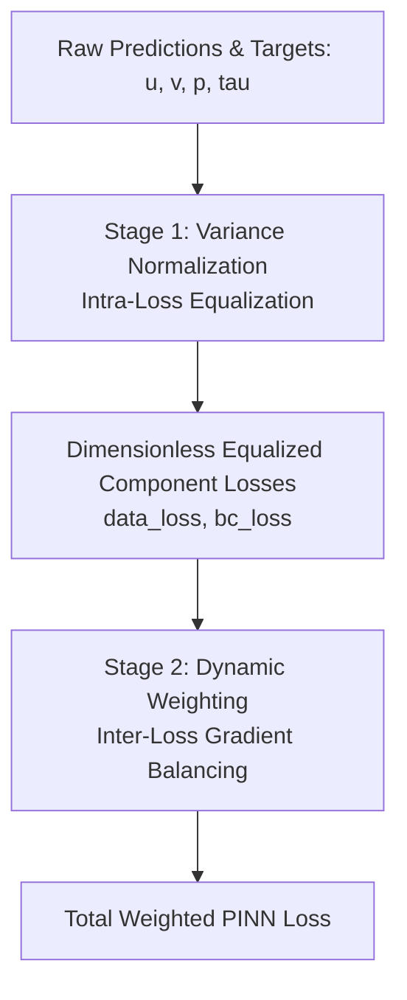

# System: Viscoelastic Training Experiment

## Overview
This document serves as the comprehensive technical and architectural specification for the Viscoelastic PINN training pipeline implemented in `Viscoelastic_main.py` and `Viscoelastic/src/Viscoelastic_PINN.py`. While [[Viscoelastic_Fluids]] covers the physical governing equations (Navier-Stokes and Oldroyd-B), this guide details the neural network architectures, training orchestration, boundary condition implementation, and hyperparameter configurations.

## Neural Network Architectures
The training pipeline decouples the discovery of the physical fields using a multi-network architecture unified by `ViscoelasticCombinedModel`, as conceptualized in [[ViscoelasticNet]]:

### 1. Sub-Network Definitions
- **Stream Function (`model_psi`)**: An [[FCN]] taking $(x,y)$ and outputting scalar $\psi$. Velocity components are derived via autograd: $u = \partial\psi/\partial y, v = -\partial\psi/\partial x$. This guarantees a divergence-free velocity field ($\nabla \cdot \mathbf{u} = 0$) by construction.
- **Pressure (`model_p`)**: An [[FCN]] outputting scalar $p$.
- **Polymeric Stress (`model_tau`)**: An [[FCN]] outputting 3 stress components: $(\tau_{xx}, \tau_{xy}, \tau_{yy})$.

### 2. Architectural Design Choices
- **Tapered Layers**: Funnel-style layer configurations (e.g., `[2, 120, 100, 80, 60, 40, 20, 1]` for scalar outputs and `[2, 120, 100, 80, 60, 40, 20, 3]` for stress) are used to condense features hierarchically (see [[Tapered_Architectures]]).
- **Activation Function**: `nn.SiLU` ([[Activation_Functions]]) is selected as the standard activation due to its smooth second derivatives, which are essential for calculating stable Laplacian terms in Navier-Stokes.
- **Explicit Zero Initialization**: To prevent initial random noise from destabilizing early kinematic learning, the final linear layers (weights and biases) of `model_tau` and `model_p` are explicitly initialized to zero via `initialize_last_layer_zero()`.
- **Velocity Inference Wrapper**: A utility module `VelocityInferenceWrapper` is used during evaluation to extract $u(x,y)$ cleanly for validation metrics and plotting.

## Staged Training Orchestration
To overcome the severe gradient competition between smooth kinematic variables and highly non-linear stress fields, the pipeline employs a 3-phase decoupled training strategy. For the overarching theoretical framework, see [[Staged_Training_Procedure]].

```mermaid
graph TD
    A[Phase 1: Kinematics & Rheology<br>Adam FP32 - 50% Epochs<br>Active: psi, tau | Frozen: p<br>BCs: u, v, txx, txy, tyy] --> B[Phase 2: Dynamics<br>Adam FP32 - 50% Epochs<br>Active: psi, p | Frozen: tau<br>BCs: u, v, p]
    B --> C[Phase 3: Full Coupled Refinement<br>L-BFGS FP64<br>Active: All psi, p, tau<br>BCs: All 6 fields]
```

### Phase 1: Kinematics & Rheology (Adam - First 50% Epochs)
- **Active Networks**: `model_psi`, `model_tau` (`set_model_trainable(model, ['psi', 'tau'])`)
- **Frozen Networks**: `model_p`
- **Active PDE Losses**: `constitutive` (Oldroyd-B ON), `momentum: 0.0` (Navier-Stokes OFF).
- **Active Boundary Conditions**: `current_active_bcs = ['u', 'v', 'txx', 'txy', 'tyy']` (Pressure BCs excluded).
- **Physical Objective**: Learn the stream function $\psi$ (velocity profile) from boundary/internal data while simultaneously discovering the corresponding polymeric stress field $\boldsymbol{\tau}$ via the Oldroyd-B constitutive laws, completely isolated from pressure fluctuations.

### Phase 2: Dynamics (Adam - Second 50% Epochs)
- **Active Networks**: `model_psi`, `model_p` (`set_model_trainable(model, ['psi', 'p'])`)
- **Frozen Networks**: `model_tau`
- **Active PDE Losses**: `momentum` ON, `constitutive` ON (All PDEs active).
- **Active Boundary Conditions**: `current_active_bcs = ['u', 'v', 'p']` (Stress BCs excluded).
- **Physical Objective**: Freeze the discovered stress field and learn the pressure distribution $p(x,y)$ required to balance the Navier-Stokes momentum equations.

### Phase 3: Full Coupled Refinement (L-BFGS)
- **Active Networks**: **All Networks** (`psi`, `p`, `tau` fully unfrozen).
- **Precision Mode**: Switches to **FP64** (`torch.float64`) for scientific-grade precision (see [[Staged_Precision_Strategy]]).
- **Active PDE & BCs**: All PDE residuals and all 6 boundary conditions (`u, v, p, txx, txy, tyy`) are active (`current_active_bcs = None`).
- **Physical Objective**: Perform joint full-batch optimization using L-BFGS (`max_iters=100`) to achieve global physical consistency across all coupled equations.

## Boundary Conditions & Exact Geometric Slicing (Debugging Guide)
The generation of boundary coordinates (`generate_boundaries` in `Viscoelastic_physics.py`) implements rigorous geometric slicing (**Proposta 1**) to prevent numerical artifacts during mini-batch sampling.

### 1. The Corner Duplication Pitfall (Historical Mechanism)
Previously, naive `torch.linspace` calls across full boundary lengths resulted in the 4 corner vertices $(0,0), (0,L_y), (L_x,0), (L_x,L_y)$ appearing **twice** in `xy_boundary`. This caused:
- **Sampling Imbalance**: Corners had twice the probability of being sampled in `_sample_minibatch`.
- **Gradient Fighting (Physical Conflict)**: Duplicate corner points belonged to different boundary segments with conflicting normal vectors and targets. At inlet corners $(0,0)$ and $(0,L_y)$, Inlet Dirichlet targets ($\tau=\tau_{\text{exact}}$) clashed directly with Wall Neumann targets ($\partial\tau/\partial y = 0$), causing severe local oscillations.

### 2. Rigorous Geometric Slicing (Current Implementation)
To enforce a strict physical hierarchy, the boundary generation logic slices tensors explicitly:
```python
# 1. Inlet (x=0): Governs full y in [0, Ly] -> Ny points (owns (0,0) and (0,Ly))
y_inlet = torch.linspace(0, Ly, Ny)

# 2. Walls (y=0, Ly): Govern x in (0, Lx] -> Nx-1 points (excludes x=0, owns (Lx,0) and (Lx,Ly))
x_wall = torch.linspace(0, Lx, Nx)[1:]

# 3. Outlet (x=Lx): Governs y in (0, Ly) -> Ny-2 points (excludes y=0 and y=Ly)
y_outlet = torch.linspace(0, Ly, Ny)[1:-1]
```
- **Exact Perimeter Count**: The total boundary points generated match the exact discrete perimeter of an $N_x \times N_y$ grid:
  $$N_{\text{boundary}} = N_y + 2(N_x - 1) + (N_y - 2) = 2N_x + 2N_y - 4$$
  Every boundary point appears exactly once, ensuring perfectly balanced stochastic mini-batch sampling and eliminating gradient fighting.

## Training Configurations & Hyperparameters
The pipeline supports automated grid search across architectures, epochs, and learning rate strategies, orchestrating three primary training goals:

### 1. Training Goals (`GOAL_CONFIGS`)
- **Goal 0 (`PurePhys`)**: Weights `{'bc': 1.0, 'physics': 1.0, 'data': 0.0}`. Trains purely on physics collocation points and BCs.
- **Goal 1 (`Phys+Data` / Semi-Inverse)**: Weights `{'bc': 1.0, 'physics': 1.0, 'data': 1.0}`. Uses internal velocity data $(u,v)$ alongside physics. See [[ViscoelasticNet]] for semi-inverse variance scaling details.
- **Goal 2 (`SoloData`)**: Weights `{'bc': 1.0, 'physics': 0.0, 'data': 1.0}`. Staged training is disabled; trains purely as a standard regression network on dense internal data.

### 2. Loss Weighting & Variance Normalization (Two-Stage Balancing Strategy)
To ensure stable optimization across highly disparate physical fields, the pipeline implements a rigorous two-stage loss balancing hierarchy:



#### Stage 1: Variance Normalization (Intra-Loss Equalization)
In multi-field viscoelasticity, variables exhibit massive dimensional and magnitude disparities (e.g., velocity $u \approx 1$ m/s vs polymeric stress $\tau_{xx} \approx 1000$ Pa scaling quadratically with shear rate). Unnormalized Mean Squared Error (MSE) would cause the optimizer to focus exclusively on minimizing the largest absolute numbers (stress/pressure), completely ignoring critical kinematic errors.

To solve this, MSE loss terms for direct data/boundary comparisons are divided by the exact target variance ($\sigma^2_k$):
$$\mathcal{L}_{\text{data}, k} = \frac{1}{\sigma_k^2} \frac{1}{N} \sum_{i=1}^N \left( y_{\text{pred}, k}^{(i)} - y_{\text{exact}, k}^{(i)} \right)^2$$
- **Dimensional Equalization**: Converts absolute dimensional errors into dimensionless relative errors representing the fraction of unexplained variance ($1 - R^2$). A 10% relative error in velocity $u$ produces the exact same numerical penalty as a 10% relative error in stress $\tau_{xx}$.
- **Protection Clamping**: Variances are clamped via `max(var, VARIANCE_EPS)` (`VARIANCE_EPS = 1.0`) to prevent division by zero or gradient explosion for zero-variance fields (e.g., $v=0$ in laminar channel flow).
- **Scope of Application**: Variance normalization is applied **exclusively** to direct numerical target comparisons (`data_loss` and `bc_loss`). It is **NEVER** applied to PDE residuals (`pde_loss`), because terms within a differential equation (Navier-Stokes/Oldroyd-B) are already dimensionally balanced by the laws of physics.

#### Stage 2: Dynamic Weighting (Inter-Loss Gradient Balancing)
Once individual loss components are internally equalized, Learning Rate Annealing ([[Dynamic_Weighting]]) dynamically adjusts the global loss weights ($\lambda_{\text{data}}, \lambda_{\text{bc}}, \lambda_{\text{pde}}$) every 100 epochs (`alpha=0.9`). This balances the gradient interaction between competing training objectives (e.g., fitting observed data vs obeying physical PDE constraints).

#### Phase-by-Phase Normalization Breakdown (Goal 1: Phys+Data)
Depending on the active training goal, variance normalization behaves as follows:
- **Goal 1 (`Phys+Data` / Semi-Inverse)**: Variance normalization (`VAR_WEIGHTS`) is active on internal velocity data and active boundary conditions.
- **Goal 0 (`PurePhys`) & Goal 2 (`SoloData`)**: Explicitly configured with `var_weights = None`. Uses standard unnormalized MSE.

The exact error evaluation and normalization schedule for **Goal 1** across the staged training phases is summarized below:

| Training Phase | `data_loss` (Normalized?) | `bc_loss` (Normalized?) | `pde_loss` (Normalized?) |
| :--- | :--- | :--- | :--- |
| **Phase 1 (Adam 0-50%)** | $u, v$ (**YES**, via $\sigma^2_u, \sigma^2_v$) | $u, v, \tau_{xx}, \tau_{xy}, \tau_{yy}$ (**YES**, via $\sigma^2$) | Oldroyd-B Constitutive (**NO**) |
| **Phase 2 (Adam 50-100%)** | $u, v$ (**YES**, via $\sigma^2_u, \sigma^2_v$) | $u, v, p$ (**YES**, via $\sigma^2$) | Navier-Stokes + Oldroyd-B (**NO**) |
| **Phase 3 (L-BFGS Refinement)** | $u, v$ (**YES**, via $\sigma^2_u, \sigma^2_v$) | All 6 active fields (**YES**, via $\sigma^2$) | Navier-Stokes + Oldroyd-B (**NO**) |

### 3. Optimizer & Mini-batching
- **Adam Optimizer**: `base_lr=1e-3`, `adam_eps=1e-7`.
- **LR Scheduler**: `CosineAnnealingLR` (or Plateau/Step).
- **Mini-batching**: `minibatch_internal=1024`, `minibatch_boundary=256` (sampled via `_sample_minibatch`).
- **GPU Optimization**: Explicitly caches device and dtype states, and disables `cudnn.benchmark` to prevent CPU/GPU synchronization overheads (see [[GPU_Optimization]]).

## Related Wiki Links
- **Physics & Theory**: [[Viscoelastic_Fluids]], [[Oldroyd_B_Model]], [[Viscoelasticity]]
- **Methods**: [[ViscoelasticNet]], [[Staged_Training_Procedure]], [[Tapered_Architectures]], [[Dynamic_Weighting]], [[Staged_Precision_Strategy]], [[GPU_Optimization]], [[Viscoelastic_Metrics]], [[Loss_History_Tracking]]
