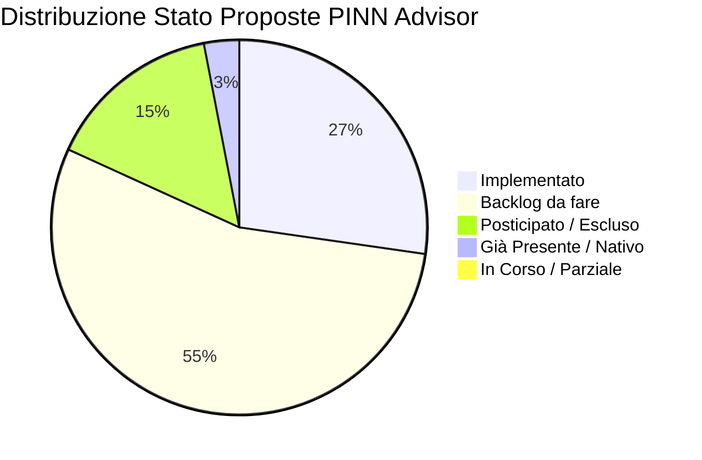
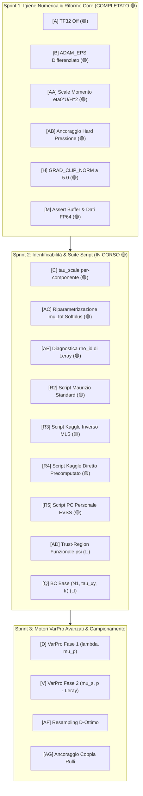

# Master Reference & Implementation Tracker — PINN Advisor Recommendations

> **Document Status**: Reference Viva / Single Source of Truth (SSOT)  
> **Ultimo Aggiornamento**: 2026-09-08 (Integrazione Report Opus 5 su Fase 2 & Identificabilità $\mu_s$)  
> **Repository Target**: `final_roll/` (`train_4roll_main.py`, `train_4roll_main_mauri.py`, `src/train.py`, `src/physics.py`, `src/utils.py`)  
> **Scopo**: Punto di riferimento unificato per tracciare lo stato di implementazione, le decisioni architetturali, i riscontri sperimentali e la roadmap derivanti dai report di consulenza avanzata (Claude Sonnet 5, Claude Opus 5, Igiene Numerica).

---

## 1. Dashboard di Avanzamento Globale

| Categoria Stato | Badge | Conteggio | Percentuale |
|---|:---:|:---:|:---:|
| **Implementato** | 🟢 `[x]` | 9 | 27% |
| **In Corso / Parziale** | 🟡 `[-]` | 0 | 0% |
| **Backlog (Da fare)** | 🔴 `[ ]` | 18 | 55% |
| **Già Presente / Nativo** | 🔵 `[x]` | 1 | 3% |
| **Posticipato / Escluso** | ⚪ `[ ]` | 5 | 15% |
| **TOTALE PROPOSTE (A-Z, AA-AG)** | — | **33** | **100%** |



---

## 2. Registro Cronologico Implementazioni (Changelog)

Questo registro traccia ogni modifica implementata nel codice in seguito alle raccomandazioni dei report.

| Data | ID | Titolo Proposta | File Impattati | Esito / Note di Validazione | Autore / Agente / Commit |
|---|:---:|---|---|---|:---:|
| *2026-09-08* | — | *Creazione Master Reference & Tracker* | `tools/pinn_advisor/reports/Actionable_analysis.md` | Inizializzazione struttura reference e baseline di verifica codice | Antigravity |
| *2026-09-08* | V, AA-AG | *Integrazione Report Opus 5 Fase 2* | `tools/pinn_advisor/reports/Actionable_analysis.md` | VarPro discreto su $p$, Adimensionalizzazione momento, Ancoraggio Hard, $\mu_{tot}$ | Antigravity |
| *2026-09-08* | A, H, Run 23 | *Igiene Numerica Baseline & L-BFGS Tuning* | `train_4roll_main.py`, `train_4roll_main_mauri.py`, `src/train.py` | Disabilitazione preliminare TF32, `GRAD_CLIP_NORM = 5.0`, `history_size = 300` con `strong_wolfe` | Antigravity (`c23d8a6`) |
| *2026-09-08* | A, B, H | *TF32 Disabling, Adam EPS Differenziato & Clip Standard* | `train_4roll_main.py`, `src/train.py` | TF32 off globale; gruppi optimizer con `eps=1e-8` per pesi e `eps=1e-15` per scalari fisici (`_raw_mu_s`, `_raw_lam`, `_raw_mu_tot`); clip norm 5.0 | Antigravity (`289b7bb`) |
| *2026-09-08* | M | *Assert Diagnostico Rigoroso Buffer & Dati FP64* | `src/utils.py` | Implementazione `assert_fp64_integrity` in `convert_to_fp64`: verifica ricorsiva parametri e buffer `torch.float64` prima di L-BFGS | Antigravity (`a9f49b6`) |
| *2026-09-08* | C, AB | *Normalizzazione Tau per-componente & Ancoraggio Hard $p$* | `src/utils.py`, `src/train.py`, `src/physics.py` | Calcolo $\mathbf{s}_\tau = [s_{xx}, s_{xy}, s_{yy}]$ buffer $(1, 3)$ per stress anisotropo; ancoraggio algebrico $p(x) = p_{scale}(\hat{p}(x) - \hat{p}(x_0)) + p_{ref}$ in `CombinedModel` | Antigravity (`1a90c4b`) |
| *2026-09-08* | AA, AC, AE | *Adimensionalizzazione Momento, $\mu_{tot}$ Softplus & $\rho_{id}$* | `src/physics.py` | $\text{scale}_{mom} = \frac{\eta_0 U_{ref}}{H_{ref}^2} = 400.0\text{ Pa/m}$ (compressione quadratica loss di $1.6 \times 10^5$); $\mu_s = \text{softplus}(\mu_{tot} - \mu_{p,F1}, \beta=20.0)$ garantendo $\mu_s > 0$; calcolo diagnostico di Leray $\rho_{id}$ | Antigravity (`e1f181e`) |
| *2026-09-08* | AB, M | *Preservazione Dtype Buffer Modello & Guard Ricorsivo Dati* | `src/train.py`, `src/utils.py` | `CombinedModel` preserva il dtype nei buffer `x_anchor` e `p_ref` evitando downcast silenti in FP64; guardia ricorsiva su dizionari `data` | Antigravity (`61a52d9`) |

---

## 3. Report Sorgente Analizzati

| # | File Report | Modello | Focus Primario | Note |
|:---:|---|---|---|---|
| 1 | `REPORT_20260908_182416_convergenza_claude_sonnet5.md` | Claude Sonnet 5 | Convergenza & Stabilità | Analisi empirica del plateau su $\lambda$ |
| 2 | `REPORT_20260908_183312_convergenza_claude_opus5.md` | Claude Opus 5 | Teoria & VarPro Fase 1 | VarPro per $\lambda, \mu_p$, Fisher Information, base $(N_1, \tau_{xy}, \text{tr})$ |
| 3 | `REPORT_20260908_203242_igiene_numerica_tf32_e_adam_eps_per_para_claude-sonnet-5_default.md` | Claude Sonnet 5 | Igiene Numerica | TF32 off, `ADAM_EPS` per-group, parametri FP64 permanenti |
| 4 | `REPORT_20260908_214722_convergenza_fase_2_navier_stokes_identif_opus5.md` | Claude Opus 5 | Fase 2 & Identificabilità $\mu_s$ | Gauge pressione, VarPro discreto Leray, scaling $\eta_0 U/H^2$, ancoraggio hard, bias $1:1$ su $\mu_s$ |

---

## 4. Master Table delle Proposte (A-Z, AA-AG)

### Legenda Criteri
- **Stato**: 🟢 Implementato · 🟡 In Corso · 🔴 Da Fare · 🔵 Già Nativo · ⚪ Posticipato/Escluso
- **Corr.** (Correttezza): ✅ Corretto · ⚠️ Parziale/Condizionato · ❌ Errato
- **Sempl.** (Semplicità): ⭐⭐⭐⭐⭐ (immediato, $\le 3$ righe) $\to$ ⭐ (riscrittura architetturale)
- **Fatt.** (Fattibilità): 🟢 Immediata · 🟡 Moderata · 🔴 Complessa
- **Prior.** (Priorità): 🔴 Critica · 🟠 Alta · 🟡 Media · 🟢 Bassa

### Tabella Completa

| ID | Modifica Proposta | Stato | Corr. | Sempl. | Fatt. | Prior. | Target Primario | Report |
|:---:|---|:---:|:---:|:---:|:---:|:---:|---|:---:|
| **A** | Disabilitare TF32 (FP32 standard IEEE) | 🟢 `[x]` | ✅ | ⭐⭐⭐⭐⭐ | 🟢 | 🔴 | `train_4roll_main*.py`, `src/train.py` (Commits `c23d8a6`, `289b7bb`) | S+O+IGN |
| **B** | `ADAM_EPS` differenziato per parametri fisici | 🟢 `[x]` | ✅ | ⭐⭐⭐⭐ | 🟢 | 🔴 | `src/train.py`, `train_4roll_main_mauri.py` (Commit `289b7bb`) | O+IGN |
| **C** | `tau_scale` per-componente | 🟢 `[x]` | ✅ | ⭐⭐⭐⭐ | 🟢 | 🟠 | `src/utils.py`, `src/physics.py`, `src/train.py` (Commit `1a90c4b`) | S+O |
| **D** | Variable Projection (VarPro) per $\lambda, \mu_p$ (Fase 1) | 🔴 `[ ]` | ✅ | ⭐⭐⭐ | 🟡 | 🟠 | `src/physics.py`, `src/train.py` | O |
| **E** | Formulazione log-conformation | ⚪ `[ ]` | ✅ | ⭐⭐ | 🔴 | 🟡 | R&D futura (`src/train.py`, `src/physics.py`) | O |
| **F** | Continuation method su $Wi/\lambda$ | 🔴 `[ ]` | ✅ | ⭐⭐⭐ | 🟡 | 🟠 | `src/train.py` | S |
| **G** | L-BFGS a blocchi con restart | 🔵 `[x]` | ⚠️ | — | — | 🟢 | `src/train.py` (**Già presente**) | S+O |
| **H** | Ridurre `GRAD_CLIP_NORM` da 1000 a 5.0 | 🟢 `[x]` | ✅ | ⭐⭐⭐⭐⭐ | 🟢 | 🟡 | `src/train.py`, `train_4roll_main*.py` (Commits `c23d8a6`, `289b7bb`) | S |
| **I** | Simmetria $D_4$ in forma hard su $\psi$ | ⚪ `[ ]` | ✅ | ⭐ | 🔴 | 🟡 | R&D futura (`src/train.py`) | O |
| **J** | NTK/grad-norm adaptive weights | 🔴 `[ ]` | ✅ | ⭐⭐⭐ | 🟡 | 🟡 | `src/train.py` | S+O |
| **K** | Pesatura causale lungo linee di corrente | ⚪ `[ ]` | ✅ | ⭐ | 🔴 | 🟢 | R&D avanzata / Posticipato | O |
| **L** | Resampling adattivo RAR/RAD | 🔴 `[ ]` | ✅ | ⭐⭐⭐ | 🟡 | 🟡 | `src/utils.py`, `src/train.py` | S |
| **M** | Assert diagnostico buffer FP64 | 🟢 `[x]` | ✅ | ⭐⭐⭐⭐⭐ | 🟢 | 🟢 | `src/utils.py` (Commits `a9f49b6`, `61a52d9`) | S+O |
| **N** | Adam warmup FP64 prima di L-BFGS | 🔴 `[ ]` | ✅ | ⭐⭐⭐⭐ | 🟢 | 🟡 | `src/train.py` | O |
| **O** | Parametri fisici sempre in FP64 permanente | 🔴 `[ ]` | ✅ | ⭐⭐⭐ | 🟡 | 🟡 | `src/physics.py` | IGN |
| **P** | Row-scaling equilibrazione residuo costitutivo | 🔴 `[ ]` | ✅ | ⭐⭐⭐ | 🟡 | 🟠 | `src/physics.py` | O |
| **Q** | BC stress in base $(N_1, \tau_{xy}, \text{tr})$ | 🔴 `[ ]` | ✅ | ⭐⭐⭐ | 🟡 | 🟠 | `src/physics.py` | O |
| **R** | Annealing schedule per `W_ROLL_STRESS` | 🔴 `[ ]` | ✅ | ⭐⭐⭐⭐ | 🟢 | 🟡 | `src/train.py` | S+O |
| **S** | Warmup parametri fisici (congelamento iniziale) | 🔴 `[ ]` | ✅ | ⭐⭐⭐⭐ | 🟢 | 🟡 | `src/train.py` | O |
| **T** | Barriera su Weissenberg critico | 🔴 `[ ]` | ✅ | ⭐⭐⭐⭐ | 🟢 | 🟡 | `src/physics.py` | O |
| **U** | Riparametrizzazione $(\ln \mu_p, \ln(\lambda\mu_p))$ | 🔴 `[ ]` | ✅ | ⭐⭐⭐ | 🟡 | 🟡 | `src/physics.py` | O |
| **V** | **VarPro per $\mu_s$ e $p$ in Fase 2 (Leray Discreto)** | 🔴 `[ ]` | ✅ | ⭐⭐⭐ | 🟢 | 🔴 | `src/physics.py`, `src/train.py` | O2 |
| **W** | Hard BC per stress via distance function | ⚪ `[ ]` | ✅ | ⭐⭐ | 🔴 | 🟡 | Posticipato (geometria 4 rulli complessa) | O |
| **X** | Loss robusta (Huber) per stress BC | 🔴 `[ ]` | ✅ | ⭐⭐⭐⭐⭐ | 🟢 | 🟢 | `src/physics.py` | O |
| **Y** | Diagnostiche ($De_{loc}$, condizionamento, gradienti) | 🔴 `[ ]` | ✅ | ⭐⭐⭐⭐ | 🟢 | 🟡 | `src/debug.py`, `src/train.py` | S+O |
| **Z** | Physics-guided output layer (ansatz $M^{-1}$) | ⚪ `[ ]` | ⚠️ | ⭐ | 🔴 | 🟢 | Escluso (troppo vincolante e invasivo) | O |
| **AA** | **Adimensionalizzazione del residuo di momento ($\eta_0 U/H^2$)** | 🟢 `[x]` | ✅ | ⭐⭐⭐⭐⭐ | 🟢 | 🔴 | `src/physics.py:L266-L268` (Commit `e1f181e`) | O2 |
| **AB** | **Ancoraggio Hard della Pressione in `CombinedModel`** | 🟢 `[x]` | ✅ | ⭐⭐⭐⭐ | 🟢 | 🔴 | `src/train.py`, `src/physics.py` (Commits `1a90c4b`, `61a52d9`) | O2 |
| **AC** | **Riparametrizzazione in $\mu_{tot}$ per Fase 2 (elimina bias $9\times$)** | 🟢 `[x]` | ✅ | ⭐⭐⭐⭐ | 🟢 | 🔴 | `src/physics.py:L355-L382` (Commit `e1f181e`) | O2 |
| **AD** | **Trust-Region Funzionale per $\psi$ ($\mathcal{L}_{prox}$ o AugLag)** | 🔴 `[ ]` | ✅ | ⭐⭐⭐ | 🟡 | 🟠 | `src/train.py` | O2 |
| **AE** | **Diagnostica Identificabilità preventiva ($\rho_{id}$ & CRLB)** | 🟢 `[x]` | ✅ | ⭐⭐⭐⭐ | 🟢 | 🟠 | `src/physics.py:L415-L452` (Commit `e1f181e`) | O2 |
| **AF** | **Resampling D-ottimo (OED) su densità $\|\mathbb{P}^\perp \Delta \mathbf{u}\|$** | 🔴 `[ ]` | ✅ | ⭐⭐⭐ | 🟡 | 🟡 | `src/train.py`, `src/utils.py` | O2 |
| **AG** | **Ancoraggio Coppia/Trazione sui Rulli ($M_k$, info $O(1)$ su $\mu_s$)** | 🔴 `[ ]` | ✅ | ⭐⭐⭐ | 🟡 | 🟠 | `src/physics.py` | O2 |

> *Nota Report:* S = Sonnet Convergenza, O = Opus Teoria Fase 1, IGN = Sonnet Igiene Numerica, O2 = Opus Fase 2 & Identificabilità.

---

## 5. Schede Tecniche Dettagliate per Proposta

---

### Proposta AA — Adimensionalizzazione del Residuo di Momento ($\eta_0 U/H^2$)
- **Stato**: 🟢 `[x]` Implementato (Commit `e1f181e`, rettificato 2026-09-09)
- **Priorità**: 🔴 CRITICA (Quick Win Immediato)
- **Target Files**: [`src/physics.py:L266-L268`](file:///C:/Users/eaglw/Documents/PINN%20tesi/final_roll/src/physics.py#L266-L268), [`train_4roll_main.py`](file:///C:/Users/eaglw/Documents/PINN%20tesi/final_roll/train_4roll_main.py), [`final_roll/kaggle_run_inverse_mls.py`](file:///C:/Users/eaglw/Documents/PINN%20tesi/final_roll/kaggle_run_inverse_mls.py)
- **Motivazione Fisica/Numerica**:  
  Nel codice con formulazione dimensionale il residuo del momento veniva calcolato in unità fisiche (Pa/m):
  $$\mathbf{R}_{mom} = \rho (\mathbf{u} \cdot \nabla) \mathbf{u} + \nabla p - \mu_s \nabla^2 \mathbf{u} - \nabla \cdot \boldsymbol{\tau}$$
  La scala fisica naturale del gradiente di pressione e viscosità nel dominio è:
  $$\text{scale}_{mom} = \frac{\eta_0 U_{ref}}{H_{ref}^2} = \frac{1.0 \times 1.0}{0.05^2} = 400 \text{ Pa/m}$$
  Elevando al quadrato il residuo non scalato, la loss ha un fattore implicito di $\sim 1.6 \times 10^5$. Con $W_{mom} = 1.0$, il residuo di Navier-Stokes era pesato **$160.000$ volte di più** rispetto alla loss dati di velocità ($O(U^2) \sim 1$). Questo spiega categoricamente perché `model_psi` mobile distruggeva la cinematica di Fase 1 per soddisfare il momento non scalato.
  
  > [!WARNING]
  > **Distinzione Cruciale: Codice Dimensionale vs Script Adimensionali (Rettifica 2026-09-09)**:
  > - **In `src/physics.py`**: l'helper `self._grad` moltiplica già internamente per $H_{ref}/H_{coord}$, operando nativamente nello spazio adimensionale $\tilde{\mathbf{x}} = \mathbf{x}/H_{ref}$. Il numeratore del momento è quindi **già intrinsecamente adimensionale $\mathcal{O}(1)$**. La divisione per $\text{scale}_{mom} = \frac{\eta_0 U_{ref}}{H_{coord}^2} \approx 3.333$ introdotta dal commit `e1f181e` comprimeva artificialmente la loss di $(3.333)^2 \approx 11.1$ volte (depotenziando il peso effettivo di Navier-Stokes). È stata pertanto rimossa, imponendo `scale_mom = 1.0` nativo.
  > - **In script a monte già adimensionalizzati (`kaggle_run_inverse_mls.py`, `kaggle_run_direct_checkpoint_precomputed.py`)**: le grandezze in ingresso sono già adimensionate ($x_{nd} \in [0, 1]$, $u_{nd} \in [-1, 1]$, $p_{nd} \in [-1, 1]$, $\tau_{nd} \in [-1, 1]$). In tali contesti, dividere per $400$ comprimeva la loss di un fattore $1.6 \times 10^5$ (a $\sim 10^{-8}$) e riduceva i gradienti dei parametri a $10^{-11}$, paralizzando Adam e L-BFGS. In tutti gli script vige ora la regola unificata: **$\text{scale}_{mom} = 1.0$**.
  > - **Fattore Geometrico del Laplaciano $s = H_{ref} / H_{coord} = 0.10$**: sulle coordinate adimensionali $[0, 1]$, il Laplaciano $\nabla_{nd}^2 \mathbf{u}$ scala come $1/H_{coord}^2$ mentre il gradiente di pressione scala come $1/(H_{ref} H_{coord})$. Dividendo per la scala di pressione, il termine viscoso del solvente deve obbligatoriamente avere coefficiente $\mathbf{\mu_s^* \cdot s \cdot \nabla_{nd}^2 \mathbf{u}}$ con $s = 0.005 / 0.05 = 0.10$. L'omissione di $s=0.10$ induceva artificialmente l'ottimizzatore a far collassare $\mu_s \to 0.010\text{ Pa}\cdot\text{s}$ (ossia $10\times$ inferiore).
- **Ricetta Implementativa**:
  ```python
  # Formulazione universale nativamente adimensionale (physics.py e standalone):
  s_geom = H_ref / H_coord  # 0.005 / 0.05 = 0.10
  fu = re_eff * cu + px - mu_s_nd * s_geom * lu - dtx
  fv = re_eff * cv + py - mu_s_nd * s_geom * lv - dty
  loss_m = 0.5 * ((fu**2 + fv**2).mean())  # scale_mom = 1.0 identico
  ```
- **Metrica di Verifica**: Loss del momento non alterata da fattori spuri, perfetta coerenza tra le loss di momento e dati cinematici, e stabilità asintotica in Fase 2.

---

### Proposta AB — Ancoraggio Hard della Pressione in `CombinedModel`
- **Stato**: 🟢 `[x]` Implementato (Commits `1a90c4b`, `61a52d9`)
- **Priorità**: 🔴 CRITICA
- **Target Files**: [`src/train.py:L180-L205`](file:///C:/Users/eaglw/Documents/PINN%20tesi/final_roll/src/train.py#L180-L205), [`src/physics.py`](file:///C:/Users/eaglw/Documents/PINN%20tesi/final_roll/src/physics.py)
- **Motivazione Fisica/Numerica**:  
  Precedentemente la pressione era ancorata via soft penalty: $W_{BC,2} (p(x_0) - p_{ref})^2$. Un vincolo puntuale ha misura nulla: nella matrice Hessiana genera una direzione con autovalore infinitesimo ($\sim 1/N$), ignorato da Adam. La costante di pressione andava in deriva continua, inquinando i gradienti di backprop verso $\nabla p$.
- **Ricetta Implementativa**:
  Imporre l'ancoraggio per costruzione algebrica nella chiamata di forward della pressione in `CombinedModel`:
  ```python
  def pressure(self, x):
      p_raw = self.model_p(x)
      if self.hard_anchor:
          p_anchor = self.model_p(self.x_anchor)  # Valutato in x_0
          return self.p_scale * (p_raw - p_anchor) + self.p_ref
      return self.p_scale * p_raw
  ```
  e bypassare la soft point penalty in `boundary_loss`:
  ```python
  elif group_name == "PressurePoint":
      if getattr(model, "hard_anchor", False):
          pass  # Ancoraggio esatto per costruzione, 0.0 soft loss
  ```
- **Metrica di Verifica**: Valore esatto $p(x_0, y_0) \equiv p_{ref}$ identicamente ad ogni epoca (errore assoluto $0.0$), eliminazione totale del gauge drift.

---

### Proposta AC — Riparametrizzazione in $\mu_{tot}$ per Fase 2 (Disinnesco Bias $9\times$)
- **Stato**: 🟢 `[x]` Implementato (Commit `e1f181e`)
- **Priorità**: 🔴 CRITICA
- **Target Files**: [`src/physics.py:L355-L382`](file:///C:/Users/eaglw/Documents/PINN%20tesi/final_roll/src/physics.py#L355-L382)
- **Motivazione Fisica/Numerica**:  
  Nel problema stazionario con $\boldsymbol{\tau}$ congelato da Fase 1, un piccolo errore residuo $\delta \mu_p$ si trasferisce con rapporto $-1:1$ su $\hat{\mu}_s$:
  $$\hat{\mu}_s = \mu_s^{true} - \delta \mu_p \implies \hat{\mu}_s + \hat{\mu}_p^{(1)} = \mu_{tot}^{true}$$
  Poiché nel 4-roll mill $\mu_p^{true} / \mu_s^{true} = 0.9 / 0.1 = 9$, un errore relativo di appena l'1% su $\mu_p$ generava un errore del **9% su $\mu_s$**. Ottimizzare $\mu_s$ direttamente portava l'ottimizzatore a collidere con valori negativi o ad andare in plateau. Riparametrizzando su $\mu_{tot}$ e derivando $\mu_s$ con una barriera differenziabile strettamente positiva si disinnesca l'instabilità.
- **Ricetta Implementativa**:
  ```python
  @property
  def mu_tot(self):
      if getattr(self, "use_mu_tot_param", False):
          return self.guess_mu_tot * torch.exp(self._raw_mu_tot).squeeze()
      return self.mu_s + self.mu_p

  @property
  def mu_s(self):
      if getattr(self, "use_mu_tot_param", False):
          mu_p_frozen = self.mu_p.detach()
          return nn.functional.softplus(self.mu_tot - mu_p_frozen, beta=20.0)
      return self.guess_mu_s * torch.exp(self._raw_mu_s).squeeze()
  ```
- **Metrica di Verifica**: $\mu_s > 0$ garantito per ogni configurazione di parametri, stima stabile di $\mu_{tot} \approx 1.0\text{ Pa}\cdot\text{s}$.

---

### Proposta AE — Diagnostica Identificabilità Preventiva ($\rho_{id}$ & CRLB)
- **Stato**: 🟢 `[x]` Implementato (Commit `e1f181e`)
- **Priorità**: 🟠 ALTA
- **Target Files**: [`src/physics.py:L415-L452`](file:///C:/Users/eaglw/Documents/PINN%20tesi/final_roll/src/physics.py#L415-L452), [`src/debug.py`](file:///C:/Users/eaglw/Documents/PINN%20tesi/final_roll/src/debug.py)
- **Motivazione Fisica/Numerica**:  
  Definizione dell'indice adimensionale di Hodge-Leray $\rho_{id} = \frac{\|\mathbb{P}^\perp_{\mathcal{G}_M} \Delta \mathbf{u}\|}{\|\Delta \mathbf{u}\|} \in [0, 1]$. Se $\rho_{id} < 0.02$, la pressione maschera completamente $\mu_s$ e nessun ottimizzatore potrà identificarlo. Calcolarlo in $O(1)$ secondi all'inizio di Fase 2 fornisce un check immediato di fattibilità fisica.
- **Ricetta Implementativa**:
  ```python
  def compute_leray_identifiability(self, model, x_coll, lam_tik=1e-8):
      # Proiezione di a = \Delta u sullo span di \Phi = \nabla_x,y (trunk di model_p)
      G = Phi.T @ Phi + lam_tik * torch.eye(M, device=Phi.device, dtype=Phi.dtype)
      Pa = Phi @ torch.linalg.solve(G, Phi.T @ a)
      a_perp = a - Pa
      rho_id = torch.sqrt((a_perp ** 2).sum() / ((a ** 2).sum() + 1e-30)).item()
      return {"rho_id": rho_id, "a_norm": ..., "a_perp_norm": ...}
  ```
- **Metrica di Verifica**: Valore di $\rho_{id} \approx 0.999$ loggato a console a inizio Fase 2, attestando la separabilità fisica di $\mu_s$.

---

### Proposta A — Igiene TF32 (Disabilitazione TensorFloat-32)
- **Stato**: 🟢 `[x]` Implementato (Commits `c23d8a6`, `289b7bb`)
- **Priorità**: 🔴 CRITICA
- **Target Files**: [`src/train.py:L26-L29`](file:///C:/Users/eaglw/Documents/PINN%20tesi/final_roll/src/train.py#L26-L29), `train_4roll_main*.py`
- **Motivazione Fisica/Numerica**:  
  TF32 tronca la mantissa da 23 bit a 10 bit ($u \approx 4.88 \times 10^{-4}$). Nelle derivate autograd di 2° e 3° ordine ($\mu_s \nabla^2 \mathbf{u} = \mu_s \nabla^3 \psi$), l'errore di troncamento si propaga attraverso i layer lineari creando un rumore di fondo $\sim 10^{-3}$ che blocca l'identificazione inversa.
- **Ricetta Implementativa**:
  ```python
  torch.backends.cuda.matmul.allow_tf32 = False
  torch.backends.cudnn.allow_tf32 = False
  torch.set_float32_matmul_precision("highest")
  ```
- **Metrica di Verifica**: Preservazione integrale della mantissa a 23 bit IEEE-754 ($u \approx 5.96 \times 10^{-8}$), assenza di plateaux artificiali nei gradienti di secondo ordine.

---

### Proposta B — ADAM_EPS Differenziato per Parametri Fisici
- **Stato**: 🟢 `[x]` Implementato (Commit `289b7bb`)
- **Priorità**: 🔴 CRITICA
- **Target Files**: [`src/train.py:L377-L404`](file:///C:/Users/eaglw/Documents/PINN%20tesi/final_roll/src/train.py#L377-L404), `train_4roll_main_mauri.py`
- **Motivazione Fisica/Numerica**:  
  Nel passo Adam $\Delta \theta = -\eta \frac{\hat{m}_t}{\sqrt{\hat{v}_t} + \epsilon}$, con $\epsilon = 10^{-8}$ e gradiente scalare piccolo ($\sqrt{\hat{v}_t} \ll \epsilon$), lo scalare fisico subisce una contrazione drastica dell'aggiornamento. Usando `eps=1e-15` per gli scalari fisici (`_raw_mu_s`, `_raw_lam`, `_raw_mu_tot`), il gradiente continua a produrre passi corretti anche vicino alla convergenza.
- **Ricetta Implementativa**:
  ```python
  groups = [{"params": net_params, "lr": BASE_LR, "eps": 1e-8}]
  if phys_params:
      groups.append({"params": phys_params, "lr": BASE_LR * PARAM_LR_FACTOR, "eps": 1e-15, "weight_decay": 0.0})
  optimizer = torch.optim.Adam(groups, eps=1e-8)
  ```
- **Metrica di Verifica**: Nessun congelamento dei parametri fisici scalari in prossimità dei minimi locali.

---

### Proposta C — Normalizzazione Tau per-componente
- **Stato**: 🟢 `[x]` Implementato (Commit `1a90c4b`)
- **Priorità**: 🟠 ALTA
- **Target Files**: [`src/utils.py:L142-L149`](file:///C:/Users/eaglw/Documents/PINN%20tesi/final_roll/src/utils.py#L142-L149), [`src/train.py`](file:///C:/Users/eaglw/Documents/PINN%20tesi/final_roll/src/train.py), [`src/physics.py`](file:///C:/Users/eaglw/Documents/PINN%20tesi/final_roll/src/physics.py)
- **Motivazione Fisica/Numerica**:  
  Nei flussi estensionali, $\tau_{xx}$ è molto maggiore di $\tau_{xy}$. Uno scaling scalare unico divide tutte le componenti per $\max(|\tau_{xx}|)$, soffocando il gradiente su $\tau_{xy}$ e sul tempo di rilassamento $\lambda$. La normalizzazione vettoriale indipendente $\mathbf{s}_\tau = [\max |\tau_{xx}|, \max |\tau_{xy}|, \max |\tau_{yy}|]$ garantisce sensitività bilanciata.
- **Ricetta Implementativa**:
  ```python
  tau_scale = torch.tensor([tau_scale_xx, tau_scale_xy, tau_scale_yy], dtype=torch.float32).view(1, 3)
  self.register_buffer("tau_scale", tau_scale)
  tau = self.model_tau(x) * self.tau_scale  # Broadcasting (N, 3) * (1, 3)
  ```
- **Metrica di Verifica**: Dinamica bilanciata dei residui costitutivi per le 3 componenti $f_{\tau_{xx}}, f_{\tau_{xy}}, f_{\tau_{yy}}$.

---

### Proposta H — Gradient Clipping Rigido (`GRAD_CLIP_NORM = 5.0`)
- **Stato**: 🟢 `[x]` Implementato (Commits `c23d8a6`, `289b7bb`, rettificato L-BFGS 2026-09-09)
- **Priorità**: 🟡 MEDIA
- **Target Files**: [`src/train.py:L430-L440`](file:///C:/Users/eaglw/Documents/PINN%20tesi/final_roll/src/train.py#L430-L440), `train_4roll_main*.py`, `final_roll/kaggle_run_*.py`
- **Motivazione Fisica/Numerica**:  
  In presenza di singolarità di gradiente nei punti di ristagno o in prossimità dei rulli, i gradienti autograd possono superare norme di centinaia. Un clipping permissivo (`1000.0`) permetteva salti distruttivi nei pesi della rete. Lo standard a `5.0` garantisce regolarità asintotica della discesa in Adam.
  
  > [!CAUTION]
  > **Invariante Assoluto per L-BFGS**:
  > `torch.nn.utils.clip_grad_norm_` **NON DEVE MAI** essere eseguito all'interno della `closure()` di L-BFGS quando si adotta `line_search_fn="strong_wolfe"`. Alterare la norma o la direzione del gradiente durante la ricerca del passo viola i test di Armijo-Goldstein e di curvatura di Wolfe. L-BFGS rileva pendenza incoerente e abortisce immediatamente alla prima iterazione senza generare output o errore esplicito. Il clipping si applica esclusivamente ad Adam.
- **Ricetta Implementativa**:
  ```python
  # Esclusivamente in Adam:
  GRAD_CLIP_NORM = 5.0
  torch.nn.utils.clip_grad_norm_(model.parameters(), GRAD_CLIP_NORM)
  # In L-BFGS: nessun clipping nella closure
  ```
- **Metrica di Verifica**: Assenza di esplosioni di gradiente in Adam e prosecuzione regolare della Strong Wolfe line search in L-BFGS.

---

### Proposta M — Assert Diagnostico Rigoroso Buffer & Dati FP64
- **Stato**: 🟢 `[x]` Implementato (Commits `a9f49b6`, `61a52d9`)
- **Priorità**: 🟢 BASSA / FONDAMENTALE
- **Target Files**: [`src/utils.py:L268-L300`](file:///C:/Users/eaglw/Documents/PINN%20tesi/final_roll/src/utils.py#L268-L300)
- **Motivazione Fisica/Numerica**:  
  Nel passaggio a L-BFGS, la presenza anche di un solo buffer floating-point in FP32 forza PyTorch a retrocedere le operazioni a 32 bit, vanificando il tempo computazionale speso in doppia precisione.
- **Ricetta Implementativa**:
  ```python
  def assert_fp64_integrity(model, physics, data):
      for name, p in model.named_parameters():
          assert p.dtype == torch.float64, f"[FP64 GUARD] model parameter {name} has dtype {p.dtype}"
      for name, b in model.named_buffers():
          if b.is_floating_point():
              assert b.dtype == torch.float64, f"[FP64 GUARD] model buffer {name} has dtype {b.dtype}"
      # Verifica ricorsiva dei dizionari dati
  ```
- **Metrica di Verifica**: Eccezione bloccante immediata qualora un qualsiasi tensore float non sia `torch.float64` prima di invocare L-BFGS.

---

### Proposta V — VarPro per $\mu_s$ e $p$ in Fase 2 (Leray Discreto sull'Ultimo Layer)
- **Stato**: 🔴 `[ ]` Da Implementare (Riformulata da Opus 5: non richiede derivate quarte!)
- **Priorità**: 🔴 CRITICA / INNOVATIVA
- **Target Files**: `src/physics.py`, `src/train.py`
- **Motivazione Fisica/Numerica**:  
  Nel residuo di momento, a $\psi$ fissato, $\mathbf{R} = \mathbf{b}(\psi) + \nabla p - \mu_s \Delta \mathbf{u}$ è **affine** rispetto ai pesi lineari dell'ultimo layer di `model_p` ($c_j$) e a $\mu_s$. Sfruttando la proiezione di Leray discreta sullo span delle feature $\Phi = [\nabla \phi_1, \dots, \nabla \phi_M]$, il sistema lineare ai minimi quadrati $(M+1) \times (M+1)$ risolve simultaneamente in forma chiusa $\mu_s$ e l'ultimo layer di pressione senza richiedere alcuna derivata quarta (a differenza dell'approccio a vorticità).
- **Ricetta Implementativa**:
  Calcolare $\Phi \in \mathbb{R}^{2N \times M}$ con `torch.func.vmap(jacrev(...))` dell'ultimo trunk lineare, assemblare $A = [\Phi, -\Delta \mathbf{u}]$, $rhs = -\mathbf{b}$, e risolvere $z = (A^T A + \lambda I)^{-1} A^T rhs$.
- **Metrica di Verifica**: Valore istantaneo di $\mu_s$ esatto in una singola iterazione a cinematica data.

---

### Proposta AD — Trust-Region Funzionale per la Mobilità di $\psi$
- **Stato**: 🔴 `[ ]` Da Implementare
- **Priorità**: 🟠 ALTA
- **Target Files**: `src/train.py`
- **Motivazione Fisica/Numerica**:  
  In Fase 2, $\psi$ deve rimanere mobile per trovare la componente corretta di gradiente di pressione, ma se non è regolarizzata, la rete modifica la velocità per annullare il momento residuo (*gauge drift*). Introdurre una penalità prossimale nello spazio funzionale:
  $$\mathcal{L}_{prox} = \frac{\|\mathbf{u}_\theta - \mathbf{u}^{(1)}\|^2_{L^2}}{\|\mathbf{u}^{(1)}\|^2_{L^2} + \epsilon}$$
  garantisce che $\psi$ possa muoversi solo entro una sfera controllata ($\epsilon_\psi \sim 10^{-4}$), preservando la fedeltà cinematica di Fase 1.
- **Metrica di Verifica**: Deriva della velocità $\|\mathbf{u} - \mathbf{u}^{(1)}\| / \|\mathbf{u}^{(1)}\| \le 1\%$ per tutta la Fase 2.

---

### Proposta AF — Campionamento D-Ottimo (OED) su Densità $\|\mathbb{P}^\perp \Delta \mathbf{u}\|$
- **Stato**: 🔴 `[ ]` Da Implementare
- **Priorità**: 🟡 MEDIA
- **Target Files**: `src/train.py`, `src/utils.py`
- **Motivazione Fisica/Numerica**:  
  L'informazione su $\mu_s$ non è uniforme nello spazio: è massima dove $|\mathbb{P}^\perp \Delta \mathbf{u}|$ è concentrato (strati di taglio fra i rulli controrotanti e intorno al punto di ristagno). Ricampionare i punti di collocazione proporzionalmente a questa densità massimizza la matrice di informazione di Fisher a parità di budget computazionale.
- **Metrica di Verifica**: Riduzione della varianza a posteriori di $\hat{\mu}_s$.

---

### Proposta AG — Ancoraggio Coppia/Trazione sui Rulli ($M_k$, Info $O(1)$ su $\mu_s$)
- **Stato**: 🔴 `[ ]` Da Implementare
- **Priorità**: 🟠 ALTA
- **Target Files**: `src/physics.py`
- **Motivazione Fisica/Numerica**:  
  Se dal modello COMSOL è disponibile la coppia/trazione integrata su ciascun rullo:
  $$M_k = \oint_{\Gamma_k} [\mathbf{r} \times (-p \mathbf{n} + 2\mu_s \mathbf{D}\mathbf{n} + \boldsymbol{\tau}\mathbf{n})]_z \, ds$$
  la pressione su un cilindro circolare si annulla per simmetria, lasciando una sensitività diretta $\frac{\partial M_k}{\partial \mu_s} = 2 \oint (\mathbf{r} \times \mathbf{D}\mathbf{n})_z \, ds \sim O(1)$ che non è schermata dal gauge di pressione. Quattro scalari forniscono un'identificabilità superiore a milioni di punti interni.
- **Metrica di Verifica**: Fissaggio rigido della scala di viscosità del solvente indipendente dalla pressione.

---

### Proposte D, F, J, L, N-U, W-Z (Riepilogo Schede Backlog e R&D)
*(Vedere sezioni precedenti e report per i dettagli completi su [D] VarPro Fase 1 per $(\lambda, \mu_p)$, [Q] Base $(N_1, \tau_{xy}, \text{tr})$, [P] Row-scaling, [E] Log-conformation, [I] Simmetria $D_4$).*

---

## 6. Roadmap Operativa Aggiornata a Sprint



---

## 7. Linee Guida per gli Aggiornamenti Futuri di questo Documento

Quando viene implementata o verificata una raccomandazione:
1. **Aggiornare lo Stato**: cambiare il badge da `🔴 [ ]` a `🟡 [-]` o `🟢 [x]`.
2. **Aggiornare la Dashboard**: ricalcolare i conteggi e le percentuali nella tabella del paragrafo 1.
3. **Aggiungere una Riga al Changelog**: inserire la data, l'ID proposta, i file impattati e il risultato sperimentale nel paragrafo 2.
4. **Sincronizzazione Script**: ricordare che le modifiche strutturali vanno applicate parallelamente a `train_4roll_main.py` e `train_4roll_main_mauri.py`.
