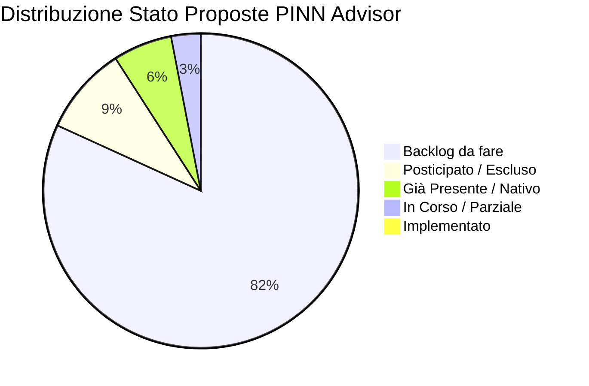
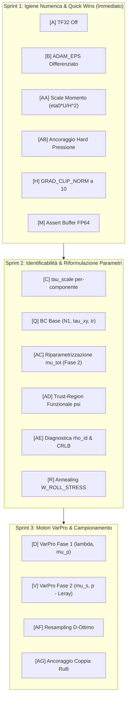

# Master Reference & Implementation Tracker — PINN Advisor Recommendations

> **Document Status**: Reference Viva / Single Source of Truth (SSOT)  
> **Ultimo Aggiornamento**: 2026-09-08 (Integrazione Report Opus 5 su Fase 2 & Identificabilità $\mu_s$)  
> **Repository Target**: `final_roll/` (`train_4roll_main.py`, `train_4roll_main_mauri.py`, `src/train.py`, `src/physics.py`, `src/utils.py`)  
> **Scopo**: Punto di riferimento unificato per tracciare lo stato di implementazione, le decisioni architetturali, i riscontri sperimentali e la roadmap derivanti dai report di consulenza avanzata (Claude Sonnet 5, Claude Opus 5, Igiene Numerica).

---

## 1. Dashboard di Avanzamento Globale

| Categoria Stato | Badge | Conteggio | Percentuale |
|---|:---:|:---:|:---:|
| **Implementato** | 🟢 `[x]` | 0 | 0% |
| **In Corso / Parziale** | 🟡 `[-]` | 1 | 3% |
| **Backlog (Da fare)** | 🔴 `[ ]` | 27 | 82% |
| **Già Presente / Nativo** | 🔵 `[x]` | 2 | 6% |
| **Posticipato / Escluso** | ⚪ `[ ]` | 3 | 9% |
| **TOTALE PROPOSTE (A-Z, AA-AG)** | — | **33** | **100%** |



---

## 2. Registro Cronologico Implementazioni (Changelog)

Questo registro traccia ogni modifica implementata nel codice in seguito alle raccomandazioni dei report.

| Data | ID | Titolo Proposta | File Impattati | Esito / Note di Validazione | Autore / Agente |
|---|:---:|---|---|---|:---:|
| *2026-09-08* | — | *Creazione Master Reference & Tracker* | `tools/pinn_advisor/reports/Actionable_analysis.md` | Inizializzazione struttura reference e baseline di verifica codice | Antigravity |
| *2026-09-08* | V, AA-AG | *Integrazione Report Opus 5 Fase 2* | `tools/pinn_advisor/reports/Actionable_analysis.md` | VarPro discreto su $p$, Adimensionalizzazione momento, Ancoraggio Hard, $\mu_{tot}$ | Antigravity |

---

## 3. Report Sorgente Analizzati

| # | File Report | Modello | Focus Primario | Note |
|:---:|---|---|---|---|
| 1 | `REPORT_20260908_182416_convergenza_claude_sonnet5.md` | Claude Sonnet 5 | Convergenza & Stabilità | Analisi empirica del plateau su $\lambda$ |
| 2 | `REPORT_20260908_183312_convergenza_claude_opus5.md` | Claude Opus 5 | Teoria & VarPro Fase 1 | VarPro per $\lambda, \mu_p$, Fisher Information, base $(N_1, \tau_{xy}, \text{tr})$ |
| 3 | `REPORT_20260908_203242_igiene_numerica_tf32_e_adam_eps_per_para_claude-sonnet-5_default.md` | Claude Sonnet 5 | Igiene Numerica | TF32 off, `ADAM_EPS` per-group, parametri FP64 permanenti |
| 4 | `REPORT_20260908_214722_convergenza_fase_2_navier_stokes_identif_opus5.md` | Claude Opus 5 | Fase 2 & Identificabilità $\mu_s$ | Gauge pressione, VarPro discreto Leray, scaling $\eta_0 U/H^2$, ancoraggio hard, bias $1:1$ su $\mu_s$ |

---

## 4. Master Table delle Proposte (A-Z, AA-AG)

### Legenda Criteri
- **Stato**: 🟢 Implementato · 🟡 In Corso · 🔴 Da Fare · 🔵 Già Nativo · ⚪ Posticipato/Escluso
- **Corr.** (Correttezza): ✅ Corretto · ⚠️ Parziale/Condizionato · ❌ Errato
- **Sempl.** (Semplicità): ⭐⭐⭐⭐⭐ (immediato, $\le 3$ righe) $\to$ ⭐ (riscrittura architetturale)
- **Fatt.** (Fattibilità): 🟢 Immediata · 🟡 Moderata · 🔴 Complessa
- **Prior.** (Priorità): 🔴 Critica · 🟠 Alta · 🟡 Media · 🟢 Bassa

### Tabella Completa

| ID | Modifica Proposta | Stato | Corr. | Sempl. | Fatt. | Prior. | Target Primario | Report |
|:---:|---|:---:|:---:|:---:|:---:|:---:|---|:---:|
| **A** | Disabilitare TF32 (FP32 standard IEEE) | 🔴 `[ ]` | ✅ | ⭐⭐⭐⭐⭐ | 🟢 | 🔴 | `train_4roll_main*.py:L52` | S+O+IGN |
| **B** | `ADAM_EPS` differenziato per parametri fisici | 🔴 `[ ]` | ✅ | ⭐⭐⭐⭐ | 🟢 | 🔴 | `src/train.py`, `train_4roll_main*.py` | O+IGN |
| **C** | `tau_scale` per-componente | 🔴 `[ ]` | ✅ | ⭐⭐⭐⭐ | 🟢 | 🟠 | `src/utils.py`, `src/physics.py`, `src/train.py` | S+O |
| **D** | Variable Projection (VarPro) per $\lambda, \mu_p$ (Fase 1) | 🔴 `[ ]` | ✅ | ⭐⭐⭐ | 🟡 | 🟠 | `src/physics.py`, `src/train.py` | O |
| **E** | Formulazione log-conformation | ⚪ `[ ]` | ✅ | ⭐⭐ | 🔴 | 🟡 | R&D futura (`src/train.py`, `src/physics.py`) | O |
| **F** | Continuation method su $Wi/\lambda$ | 🔴 `[ ]` | ✅ | ⭐⭐⭐ | 🟡 | 🟠 | `src/train.py` | S |
| **G** | L-BFGS a blocchi con restart | 🔵 `[x]` | ⚠️ | — | — | 🟢 | `src/train.py` (**Già presente**) | S+O |
| **H** | Ridurre `GRAD_CLIP_NORM` da 1000 a 10-20 | 🔴 `[ ]` | ✅ | ⭐⭐⭐⭐⭐ | 🟢 | 🟡 | `train_4roll_main*.py:L133` | S |
| **I** | Simmetria $D_4$ in forma hard su $\psi$ | ⚪ `[ ]` | ✅ | ⭐ | 🔴 | 🟡 | R&D futura (`src/train.py`) | O |
| **J** | NTK/grad-norm adaptive weights | 🔴 `[ ]` | ✅ | ⭐⭐⭐ | 🟡 | 🟡 | `src/train.py` | S+O |
| **K** | Pesatura causale lungo linee di corrente | ⚪ `[ ]` | ✅ | ⭐ | 🔴 | 🟢 | R&D avanzata / Posticipato | O |
| **L** | Resampling adattivo RAR/RAD | 🔴 `[ ]` | ✅ | ⭐⭐⭐ | 🟡 | 🟡 | `src/utils.py`, `src/train.py` | S |
| **M** | Assert diagnostico buffer FP64 | 🟡 `[-]` | ⚠️ | ⭐⭐⭐⭐⭐ | 🟢 | 🟢 | `src/utils.py` (**Parziale**: conversione attiva, manca assert) | S+O |
| **N** | Adam warmup FP64 prima di L-BFGS | 🔴 `[ ]` | ✅ | ⭐⭐⭐⭐ | 🟢 | 🟡 | `src/train.py` | O |
| **O** | Parametri fisici sempre in FP64 permanente | 🔴 `[ ]` | ✅ | ⭐⭐⭐ | 🟡 | 🟡 | `src/physics.py` | IGN |
| **P** | Row-scaling equilibrazione residuo costitutivo | 🔴 `[ ]` | ✅ | ⭐⭐⭐ | 🟡 | 🟠 | `src/physics.py` | O |
| **Q** | BC stress in base $(N_1, \tau_{xy}, \text{tr})$ | 🔴 `[ ]` | ✅ | ⭐⭐⭐ | 🟡 | 🟠 | `src/physics.py` | O |
| **R** | Annealing schedule per `W_ROLL_STRESS` | 🔴 `[ ]` | ✅ | ⭐⭐⭐⭐ | 🟢 | 🟡 | `src/train.py` | S+O |
| **S** | Warmup parametri fisici (congelamento iniziale) | 🔴 `[ ]` | ✅ | ⭐⭐⭐⭐ | 🟢 | 🟡 | `src/train.py` | O |
| **T** | Barriera su Weissenberg critico | 🔴 `[ ]` | ✅ | ⭐⭐⭐⭐ | 🟢 | 🟡 | `src/physics.py` | O |
| **U** | Riparametrizzazione $(\ln \mu_p, \ln(\lambda\mu_p))$ | 🔴 `[ ]` | ✅ | ⭐⭐⭐ | 🟡 | 🟡 | `src/physics.py` | O |
| **V** | **VarPro per $\mu_s$ e $p$ in Fase 2 (Leray Discreto)** | 🔴 `[ ]` | ✅ | ⭐⭐⭐ | 🟢 | 🔴 | `src/physics.py`, `src/train.py` | O2 |
| **W** | Hard BC per stress via distance function | ⚪ `[ ]` | ✅ | ⭐⭐ | 🔴 | 🟡 | Posticipato (geometria 4 rulli complessa) | O |
| **X** | Loss robusta (Huber) per stress BC | 🔴 `[ ]` | ✅ | ⭐⭐⭐⭐⭐ | 🟢 | 🟢 | `src/physics.py` | O |
| **Y** | Diagnostiche ($De_{loc}$, condizionamento, gradienti) | 🔴 `[ ]` | ✅ | ⭐⭐⭐⭐ | 🟢 | 🟡 | `src/debug.py`, `src/train.py` | S+O |
| **Z** | Physics-guided output layer (ansatz $M^{-1}$) | ⚪ `[ ]` | ⚠️ | ⭐ | 🔴 | 🟢 | Escluso (troppo vincolante e invasivo) | O |
| **AA** | **Adimensionalizzazione del residuo di momento ($\eta_0 U/H^2$)** | 🔴 `[ ]` | ✅ | ⭐⭐⭐⭐⭐ | 🟢 | 🔴 | `src/physics.py:L187-L215` | O2 |
| **AB** | **Ancoraggio Hard della Pressione in `CombinedModel`** | 🔴 `[ ]` | ✅ | ⭐⭐⭐⭐ | 🟢 | 🔴 | `src/train.py:L180-L205` | O2 |
| **AC** | **Riparametrizzazione in $\mu_{tot}$ per Fase 2 (elimina bias $9\times$)** | 🔴 `[ ]` | ✅ | ⭐⭐⭐⭐ | 🟢 | 🔴 | `src/physics.py` | O2 |
| **AD** | **Trust-Region Funzionale per $\psi$ ($\mathcal{L}_{prox}$ o AugLag)** | 🔴 `[ ]` | ✅ | ⭐⭐⭐ | 🟡 | 🟠 | `src/train.py` | O2 |
| **AE** | **Diagnostica Identificabilità preventiva ($\rho_{id}$ & CRLB)** | 🔴 `[ ]` | ✅ | ⭐⭐⭐⭐ | 🟢 | 🟠 | `src/physics.py`, `src/debug.py` | O2 |
| **AF** | **Resampling D-ottimo (OED) su densità $\|\mathbb{P}^\perp \Delta \mathbf{u}\|$** | 🔴 `[ ]` | ✅ | ⭐⭐⭐ | 🟡 | 🟡 | `src/train.py`, `src/utils.py` | O2 |
| **AG** | **Ancoraggio Coppia/Trazione sui Rulli ($M_k$, info $O(1)$ su $\mu_s$)** | 🔴 `[ ]` | ✅ | ⭐⭐⭐ | 🟡 | 🟠 | `src/physics.py` | O2 |

> *Nota Report:* S = Sonnet Convergenza, O = Opus Teoria Fase 1, IGN = Sonnet Igiene Numerica, O2 = Opus Fase 2 & Identificabilità.

---

## 5. Schede Tecniche Dettagliate per Proposta

---

### Proposta AA — Adimensionalizzazione del Residuo di Momento ($\eta_0 U/H^2$)
- **Stato**: 🔴 `[ ]` Da Implementare
- **Priorità**: 🔴 CRITICA (Quick Win Immediato)
- **Target Files**: [`src/physics.py:L187-L215`](file:///C:/Users/eaglw/Documents/PINN%20tesi/final_roll/src/physics.py#L187-L215), [`train_4roll_main.py`](file:///C:/Users/eaglw/Documents/PINN%20tesi/final_roll/train_4roll_main.py)
- **Motivazione Fisica/Numerica**:  
  Nel codice attuale il residuo del momento viene calcolato dimensionalmente:
  $$\mathbf{R}_{mom} = \rho (\mathbf{u} \cdot \nabla) \mathbf{u} + \nabla p - \mu_s \nabla^2 \mathbf{u} - \nabla \cdot \boldsymbol{\tau}$$
  La scala fisica naturale del gradiente di pressione e viscosità nel dominio è:
  $$\text{scale}_{mom} = \frac{\eta_0 U_{ref}}{H_{ref}^2} = \frac{1.0 \times 1.0}{0.05^2} = 400 \text{ Pa/m}$$
  Elevando al quadrato il residuo non scalato, la loss ha un fattore implicito di $\sim 1.6 \times 10^5$. Con $W_{mom} = 1.0$, il residuo di Navier-Stokes è pesato **$160.000$ volte di più** rispetto alla loss dati di velocità ($O(U^2) \sim 1$). Questo spiega categoricamente perché `model_psi` mobile distruggeva la cinematica di Fase 1 per soddisfare il momento non scalato.
- **Ricetta Implementativa**:
  ```python
  scale_mom = self.eta_0 * self.U_ref / (self.H_ref ** 2)
  loss_mom = ((res_u / scale_mom).pow(2) + (res_v / scale_mom).pow(2)).mean()
  ```
- **Metrica di Verifica**: Loss del momento normalizzata a valori $O(10^{-2} - 10^0)$ anziché $O(10^5)$, perfetta stabilità delle velocità in Fase 2.

---

### Proposta AB — Ancoraggio Hard della Pressione in `CombinedModel`
- **Stato**: 🔴 `[ ]` Da Implementare
- **Priorità**: 🔴 CRITICA
- **Target Files**: [`src/train.py:L180-L205`](file:///C:/Users/eaglw/Documents/PINN%20tesi/final_roll/src/train.py#L180-L205)
- **Motivazione Fisica/Numerica**:  
  Attualmente la pressione è ancorata via soft penalty: $W_{BC,2} (p(x_0) - p_{ref})^2$. Un vincolo puntuale ha misura nulla: nella matrice Hessiana genera una direzione con autovalore infinitesimo ($\sim 1/N$), ignorato da Adam. La costante di pressione va in deriva continua, inquinando i gradienti di backprop verso $\nabla p$.
- **Ricetta Implementativa**:
  Imporre l'ancoraggio per costruzione algebrica nella chiamata di forward della pressione:
  ```python
  def pressure(self, x):
      p_raw = self.model_p(x)
      p_anchor = self.model_p(self.x_anchor)  # Valutato nel punto di riferimento fisso (1, 1)
      return self.p_scale * (p_raw - p_anchor) + self.p_ref
  ```
- **Metrica di Verifica**: Valore esatto $p(x_0, y_0) \equiv p_{ref}$ identicamente ad ogni epoca, azzeramento del modo nullo di traslazione e rimozione della loss soft di ancoraggio.

---

### Proposta AC — Riparametrizzazione in $\mu_{tot}$ per Fase 2 (Disinnesco Bias $9\times$)
- **Stato**: 🔴 `[ ]` Da Implementare
- **Priorità**: 🔴 CRITICA
- **Target Files**: [`src/physics.py:L40-L60`](file:///C:/Users/eaglw/Documents/PINN%20tesi/final_roll/src/physics.py#L40-L60)
- **Motivazione Fisica/Numerica**:  
  Nel problema stazionario con $\boldsymbol{\tau}$ congelato da Fase 1, un piccolo errore residuo $\delta \mu_p$ si trasferisce con rapporto $-1:1$ su $\hat{\mu}_s$:
  $$\hat{\mu}_s = \mu_s^{true} - \delta \mu_p \implies \hat{\mu}_s + \hat{\mu}_p^{(1)} = \mu_{tot}^{true}$$
  Poiché nel 4-roll mill $\mu_p^{true} / \mu_s^{true} = 0.9 / 0.1 = 9$, un errore relativo di appena l'1% su $\mu_p$ genera un errore del **9% su $\mu_s$**! Ottimizzare $\mu_s$ direttamente porta l'ottimizzatore a collidere con 0 o ad andare in plateau. L'unica quantità robustamente vincolata dall'idrodinamica complessiva è la viscosità totale $\mu_{tot}$.
- **Ricetta Implementativa**:
  ```python
  # In ViscoelasticPhysics:
  @property
  def mu_tot(self):
      return self.guess_mu_tot * torch.exp(self._raw_mu_tot).squeeze()

  @property
  def mu_s(self):
      if getattr(self, "use_mu_tot_param", False):
          # mu_p congelato da Fase 1; mu_s ricavato per differenza con softplus
          return nn.functional.softplus(self.mu_tot - self.mu_p.detach(), beta=20.0)
      return self.guess_mu_s * torch.exp(self._raw_mu_s).squeeze()
  ```
- **Metrica di Verifica**: Convergenza stabile di $\mu_{tot}$ verso 1.0 Pa·s e conseguente determinazione consistente di $\mu_s$.

---

### Proposta V — VarPro per $\mu_s$ e $p$ in Fase 2 (Leray Discreto sull'Ultimo Layer)
- **Stato**: 🔴 `[ ]` Da Implementare (Riformulata da Opus 5: non richiede derivate quarte!)
- **Priorità**: 🔴 CRITICA / INNOVATIVA
- **Target Files**: `src/physics.py`, `src/train.py`
- **Motivazione Fisica/Numerica**:  
  Nel residuo di momento, a $\psi$ fissato, $\mathbf{R} = \mathbf{b}(\psi) + \nabla p - \mu_s \Delta \mathbf{u}$ è **affine** rispetto ai pesi lineari dell'ultimo layer di `model_p` ($c_j$) e a $\mu_s$. Sfruttando la proiezione di Leray discreta sullo span delle feature $\Phi = [\nabla \phi_1, \dots, \nabla \phi_M]$, il sistema lineare ai minimi quadrati $(M+1) \times (M+1)$ risolve simultaneamente in forma chiusa $\mu_s$ e l'ultimo layer di pressione senza richiedere alcuna derivata quarta (a differenza dell'approccio a vorticità).
- **Ricetta Implementativa**:
  Calcolare $\Phi \in \mathbb{R}^{2N \times M}$ con `torch.func.vmap(jacrev(...))` dell'ultimo trunk lineare, assemblare $A = [\Phi, -\Delta \mathbf{u}]$, $rhs = -\mathbf{b}$, e risolvere $z = (A^T A + \lambda I)^{-1} A^T rhs$.
- **Metrica di Verifica**: Valore istantaneo di $\mu_s$ esatto in una singola iterazione a cinematica data.

---

### Proposta AD — Trust-Region Funzionale per la Mobilità di $\psi$
- **Stato**: 🔴 `[ ]` Da Implementare
- **Priorità**: 🟠 ALTA
- **Target Files**: `src/train.py`
- **Motivazione Fisica/Numerica**:  
  In Fase 2, $\psi$ deve rimanere mobile per trovare la componente corretta di gradiente di pressione, ma se non è regolarizzata, la rete modifica la velocità per annullare il momento residuo (*gauge drift*). Introdurre una penalità prossimale nello spazio funzionale:
  $$\mathcal{L}_{prox} = \frac{\|\mathbf{u}_\theta - \mathbf{u}^{(1)}\|^2_{L^2}}{\|\mathbf{u}^{(1)}\|^2_{L^2} + \epsilon}$$
  garantisce che $\psi$ possa muoversi solo entro una sfera controllata ($\epsilon_\psi \sim 10^{-4}$), preservando la fedeltà cinematica di Fase 1.
- **Metrica di Verifica**: Deriva della velocità $\|\mathbf{u} - \mathbf{u}^{(1)}\| / \|\mathbf{u}^{(1)}\| \le 1\%$ per tutta la Fase 2.

---

### Proposta AE — Diagnostica Identificabilità Preventiva ($\rho_{id}$ & CRLB)
- **Stato**: 🔴 `[ ]` Da Implementare
- **Priorità**: 🟠 ALTA
- **Target Files**: `src/physics.py`, `src/debug.py`
- **Motivazione Fisica/Numerica**:  
  Definire l'indice adimensionale $\rho_{id} = \frac{\|\mathbb{P}^\perp \Delta \mathbf{u}\|}{\|\Delta \mathbf{u}\|} \in [0, 1]$. Se $\rho_{id} < 10^{-2}$, la pressione maschera completamente $\mu_s$ e nessun ottimizzatore potrà identificarlo. Calcolarlo in $O(1)$ secondi all'inizio di Fase 2 fornisce un check immediato di fattibilità.
- **Metrica di Verifica**: Valore di $\rho_{id}$ loggato a console a inizio Fase 2.

---

### Proposta AF — Campionamento D-Ottimo (OED) su Densità $\|\mathbb{P}^\perp \Delta \mathbf{u}\|$
- **Stato**: 🔴 `[ ]` Da Implementare
- **Priorità**: 🟡 MEDIA
- **Target Files**: `src/train.py`, `src/utils.py`
- **Motivazione Fisica/Numerica**:  
  L'informazione su $\mu_s$ non è uniforme nello spazio: è massima dove $|\mathbb{P}^\perp \Delta \mathbf{u}|$ è concentrato (strati di taglio fra i rulli controrotanti e intorno al punto di ristagno). Ricampionare i punti di collocazione proporzionalmente a questa densità massimizza la matrice di informazione di Fisher a parità di budget computazionale.
- **Metrica di Verifica**: Riduzione della varianza a posteriori di $\hat{\mu}_s$.

---

### Proposta AG — Ancoraggio Coppia/Trazione sui Rulli ($M_k$, Info $O(1)$ su $\mu_s$)
- **Stato**: 🔴 `[ ]` Da Implementare
- **Priorità**: 🟠 ALTA
- **Target Files**: `src/physics.py`
- **Motivazione Fisica/Numerica**:  
  Se dal modello COMSOL è disponibile la coppia/trazione integrata su ciascun rullo:
  $$M_k = \oint_{\Gamma_k} [\mathbf{r} \times (-p \mathbf{n} + 2\mu_s \mathbf{D}\mathbf{n} + \boldsymbol{\tau}\mathbf{n})]_z \, ds$$
  la pressione su un cilindro circolare si annulla per simmetria, lasciando una sensitività diretta $\frac{\partial M_k}{\partial \mu_s} = 2 \oint (\mathbf{r} \times \mathbf{D}\mathbf{n})_z \, ds \sim O(1)$ che non è schermata dal gauge di pressione. Quattro scalari forniscono un'identificabilità superiore a milioni di punti interni.
- **Metrica di Verifica**: Fissaggio rigido della scala di viscosità del solvente indipendente dalla pressione.

---

### Proposte A-U, W-Z (Riepilogo Schede Esistenti)
*(Vedere sezioni precedenti per i dettagli completi su [A] TF32 off, [B] `ADAM_EPS` per-group, [C] `tau_scale` per-componente, [D] VarPro Fase 1 per $(\lambda, \mu_p)$, [H] Grad Clip Norm 10, [Q] Base $(N_1, \tau_{xy}, \text{tr})$, [P] Row-scaling).*

---

## 6. Roadmap Operativa Aggiornata a Sprint



---

## 7. Linee Guida per gli Aggiornamenti Futuri di questo Documento

Quando viene implementata o verificata una raccomandazione:
1. **Aggiornare lo Stato**: cambiare il badge da `🔴 [ ]` a `🟡 [-]` o `🟢 [x]`.
2. **Aggiornare la Dashboard**: ricalcolare i conteggi e le percentuali nella tabella del paragrafo 1.
3. **Aggiungere una Riga al Changelog**: inserire la data, l'ID proposta, i file impattati e il risultato sperimentale nel paragrafo 2.
4. **Sincronizzazione Script**: ricordare che le modifiche strutturali vanno applicate parallelamente a `train_4roll_main.py` e `train_4roll_main_mauri.py`.
