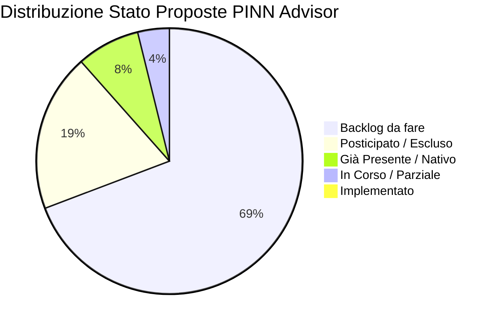
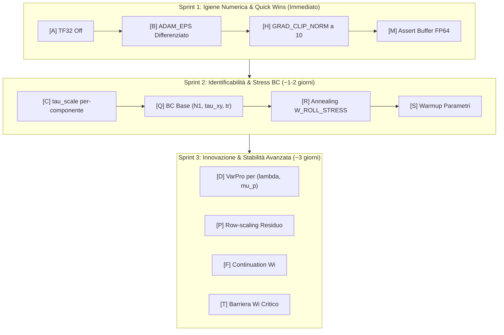

# Master Reference & Implementation Tracker — PINN Advisor Recommendations

> **Document Status**: Reference Viva / Single Source of Truth (SSOT)  
> **Ultimo Aggiornamento**: 2026-09-08  
> **Repository Target**: `final_roll/` (`train_4roll_main.py`, `train_4roll_main_mauri.py`, `src/train.py`, `src/physics.py`, `src/utils.py`)  
> **Scopo**: Punto di riferimento unificato per tracciare lo stato di implementazione, le decisioni architetturali, i riscontri sperimentali e la roadmap derivanti dai report di consulenza avanzata (Claude Sonnet 5, Claude Opus 5, Igiene Numerica).

---

## 1. Dashboard di Avanzamento Globale

| Categoria Stato | Badge | Conteggio | Percentuale |
|---|:---:|:---:|:---:|
| **Implementato** | 🟢 `[x]` | 0 | 0% |
| **In Corso / Parziale** | 🟡 `[-]` | 1 | 4% |
| **Backlog (Da fare)** | 🔴 `[ ]` | 18 | 69% |
| **Già Presente / Nativo** | 🔵 `[x]` | 2 | 8% |
| **Posticipato / Escluso** | ⚪ `[ ]` | 5 | 19% |
| **TOTALE PROPOSTE (A-Z)** | — | **26** | **100%** |



---

## 2. Registro Cronologico Implementazioni (Changelog)

Questo registro traccia ogni modifica implementata nel codice in seguito alle raccomandazioni dei report.

| Data | ID | Titolo Proposta | File Impattati | Esito / Note di Validazione | Autore / Agente |
|---|:---:|---|---|---|:---:|
| *2026-09-08* | — | *Creazione Master Reference & Tracker* | `tools/pinn_advisor/reports/Actionable_analysis.md` | Inizializzazione struttura reference e baseline di verifica codice | Antigravity |

---

## 3. Report Sorgente Analizzati

| # | File Report | Modello | Focus Primario | Note |
|:---:|---|---|---|---|
| 1 | `REPORT_20260908_182416_convergenza_claude_sonnet5.md` | Claude Sonnet 5 | Convergenza & Stabilità | Analisi empirica del plateau su $\lambda$ |
| 2 | `REPORT_20260908_183312_convergenza_claude_opus5.md` | Claude Opus 5 | Teoria & Riformulazioni | VarPro, Fisher Information, base $(N_1, \tau_{xy}, \text{tr})$, barriera $Wi$ |
| 3 | `REPORT_20260908_203242_igiene_numerica_tf32_e_adam_eps_per_para_claude-sonnet-5_default.md` | Claude Sonnet 5 | Igiene Numerica | TF32 off, `ADAM_EPS` per-group, parametri FP64 permanenti |

> [!NOTE]
> I report precedentemente denominati `ANALISI_CONVERGENZA_CLAUDE5.md` e `ANALISI_CONVERGENZA_OPUS5.md` erano duplicati rispettivamente dei report #1 e #2.

---

## 4. Master Table delle Proposte (A-Z)

### Legenda Criteri
- **Stato**: 🟢 Implementato · 🟡 In Corso · 🔴 Da Fare · 🔵 Già Nativo · ⚪ Posticipato/Escluso
- **Corr.** (Correttezza): ✅ Corretto · ⚠️ Parziale/Condizionato · ❌ Errato
- **Sempl.** (Semplicità): ⭐⭐⭐⭐⭐ (immediato, $\le 3$ righe) $\to$ ⭐ (riscrittura architetturale)
- **Fatt.** (Fattibilità): 🟢 Immediata · 🟡 Moderata · 🔴 Complessa
- **Prior.** (Priorità): 🔴 Critica · 🟠 Alta · 🟡 Media · 🟢 Bassa

### Tabella Completa

| ID | Modifica Proposta | Stato | Corr. | Sempl. | Fatt. | Prior. | Target Primario | Report |
|:---:|---|:---:|:---:|:---:|:---:|:---:|---|:---:|
| **A** | Disabilitare TF32 (FP32 standard IEEE) | 🔴 `[ ]` | ✅ | ⭐⭐⭐⭐⭐ | 🟢 | 🔴 | `train_4roll_main*.py:L52` | S+O+IGN |
| **B** | `ADAM_EPS` differenziato per parametri fisici | 🔴 `[ ]` | ✅ | ⭐⭐⭐⭐ | 🟢 | 🔴 | `src/train.py`, `train_4roll_main*.py` | O+IGN |
| **C** | `tau_scale` per-componente | 🔴 `[ ]` | ✅ | ⭐⭐⭐⭐ | 🟢 | 🟠 | `src/utils.py`, `src/physics.py`, `src/train.py` | S+O |
| **D** | Variable Projection (VarPro) per $\lambda, \mu_p$ | 🔴 `[ ]` | ✅ | ⭐⭐⭐ | 🟡 | 🟠 | `src/physics.py`, `src/train.py` | O |
| **E** | Formulazione log-conformation | ⚪ `[ ]` | ✅ | ⭐⭐ | 🔴 | 🟡 | R&D futura (`src/train.py`, `src/physics.py`) | O |
| **F** | Continuation method su $Wi/\lambda$ | 🔴 `[ ]` | ✅ | ⭐⭐⭐ | 🟡 | 🟠 | `src/train.py` | S |
| **G** | L-BFGS a blocchi con restart | 🔵 `[x]` | ⚠️ | — | — | 🟢 | `src/train.py` (**Già presente**) | S+O |
| **H** | Ridurre `GRAD_CLIP_NORM` da 1000 a 10-20 | 🔴 `[ ]` | ✅ | ⭐⭐⭐⭐⭐ | 🟢 | 🟡 | `train_4roll_main*.py:L133` | S |
| **I** | Simmetria $D_4$ in forma hard su $\psi$ | ⚪ `[ ]` | ✅ | ⭐ | 🔴 | 🟡 | R&D futura (`src/train.py`) | O |
| **J** | NTK/grad-norm adaptive weights | 🔴 `[ ]` | ✅ | ⭐⭐⭐ | 🟡 | 🟡 | `src/train.py` | S+O |
| **K** | Pesatura causale lungo linee di corrente | ⚪ `[ ]` | ✅ | ⭐ | 🔴 | 🟢 | R&D avanzata / Posticipato | O |
| **L** | Resampling adattivo RAR/RAD | 🔴 `[ ]` | ✅ | ⭐⭐⭐ | 🟡 | 🟡 | `src/utils.py`, `src/train.py` | S |
| **M** | Assert diagnostico buffer FP64 | 🟡 `[-]` | ⚠️ | ⭐⭐⭐⭐⭐ | 🟢 | 🟢 | `src/utils.py` (**Parziale**: conversione attiva, manca assert) | S+O |
| **N** | Adam warmup FP64 prima di L-BFGS | 🔴 `[ ]` | ✅ | ⭐⭐⭐⭐ | 🟢 | 🟡 | `src/train.py` | O |
| **O** | Parametri fisici sempre in FP64 permanente | 🔴 `[ ]` | ✅ | ⭐⭐⭐ | 🟡 | 🟡 | `src/physics.py` | IGN |
| **P** | Row-scaling equilibrazione residuo costitutivo | 🔴 `[ ]` | ✅ | ⭐⭐⭐ | 🟡 | 🟠 | `src/physics.py` | O |
| **Q** | BC stress in base $(N_1, \tau_{xy}, \text{tr})$ | 🔴 `[ ]` | ✅ | ⭐⭐⭐ | 🟡 | 🟠 | `src/physics.py` | O |
| **R** | Annealing schedule per `W_ROLL_STRESS` | 🔴 `[ ]` | ✅ | ⭐⭐⭐⭐ | 🟢 | 🟡 | `src/train.py` | S+O |
| **S** | Warmup parametri fisici (congelamento iniziale) | 🔴 `[ ]` | ✅ | ⭐⭐⭐⭐ | 🟢 | 🟡 | `src/train.py` | O |
| **T** | Barriera su Weissenberg critico | 🔴 `[ ]` | ✅ | ⭐⭐⭐⭐ | 🟢 | 🟡 | `src/physics.py` | O |
| **U** | Riparametrizzazione $(\ln \mu_p, \ln(\lambda\mu_p))$ | 🔴 `[ ]` | ✅ | ⭐⭐⭐ | 🟡 | 🟡 | `src/physics.py` | O |
| **V** | VarPro per $\mu_s$ in Fase 2 | ⚪ `[ ]` | ⚠️ | ⭐⭐ | 🔴 | 🟢 | Posticipato (richiede $\nabla^4 \psi$) | O |
| **W** | Hard BC per stress via distance function | ⚪ `[ ]` | ✅ | ⭐⭐ | 🔴 | 🟡 | Posticipato (geometria 4 rulli complessa) | O |
| **X** | Loss robusta (Huber) per stress BC | 🔴 `[ ]` | ✅ | ⭐⭐⭐⭐⭐ | 🟢 | 🟢 | `src/physics.py` | O |
| **Y** | Diagnostiche ($De_{loc}$, condizionamento, gradienti) | 🔴 `[ ]` | ✅ | ⭐⭐⭐⭐ | 🟢 | 🟡 | `src/debug.py`, `src/train.py` | S+O |
| **Z** | Physics-guided output layer (ansatz $M^{-1}$) | ⚪ `[ ]` | ⚠️ | ⭐ | 🔴 | 🟢 | Escluso (troppo vincolante e invasivo) | O |

---

## 5. Schede Tecniche Dettagliate per Proposta (A-Z)

---

### Proposta A — Disabilitare TF32 (FP32 IEEE 754 Standard)
- **Stato**: 🔴 `[ ]` Da Implementare
- **Priorità**: 🔴 CRITICA
- **Target Files**: [`train_4roll_main.py:L51-L53`](file:///C:/Users/eaglw/Documents/PINN%20tesi/final_roll/train_4roll_main.py#L51-L53) e [`train_4roll_main_mauri.py`](file:///C:/Users/eaglw/Documents/PINN%20tesi/final_roll/train_4roll_main_mauri.py)
- **Motivazione Fisica/Numerica**:  
  TF32 tronca la mantissa da 23 bit a soli 10 bit ($\epsilon \approx 5 \times 10^{-4}$). Con l'autodiff di derivate seconde attraverso reti profonde a 8 layer, il rumore numerico sui residui sale a $\sim 10^{-3} - 10^{-2}$. I gradienti di $\lambda$ e $\mu_p$ cadono sotto il floor di rumore quantizzato di TF32, bloccando l'aggiornamento. Il costo prestazionale del vero FP32 su reti $8 \times 128$ è trascurabile ($<5\%$).
- **Ricetta Implementativa**:
  ```python
  # Disabilita completamente TF32 per forzare il vero FP32 IEEE
  torch.set_float32_matmul_precision("highest")
  torch.backends.cuda.matmul.allow_tf32 = False
  torch.backends.cudnn.allow_tf32 = False
  ```
- **Metrica di Verifica**: Verifica che `torch.backends.cuda.matmul.allow_tf32` sia `False` prima del training. Abbassamento del floor di oscillazione del gradiente durante Adam FP32.

---

### Proposta B — `ADAM_EPS` Differenziato per Parametri Fisici
- **Stato**: 🔴 `[ ]` Da Implementare
- **Priorità**: 🔴 CRITICA
- **Target Files**: [`src/train.py:L474`](file:///C:/Users/eaglw/Documents/PINN%20tesi/final_roll/src/train.py#L474), [`src/train.py:L918`](file:///C:/Users/eaglw/Documents/PINN%20tesi/final_roll/src/train.py#L918), [`train_4roll_main.py:L131`](file:///C:/Users/eaglw/Documents/PINN%20tesi/final_roll/train_4roll_main.py#L131), [`train_4roll_main_mauri.py:L174`](file:///C:/Users/eaglw/Documents/PINN%20tesi/final_roll/train_4roll_main_mauri.py#L174)
- **Motivazione Fisica/Numerica**:  
  Adam calcola l'update come $\Delta \theta = -\eta \frac{\hat{m}}{\sqrt{\hat{v}} + \epsilon}$. Con `ADAM_EPS = 1e-7` globale, quando il gradiente scalare del parametro fisico diventa piccolo ($|g| < 10^{-7}$), $\sqrt{\hat{v}} \ll \epsilon$, quindi l'update diventa $\Delta \theta \approx -\eta \hat{m} / \epsilon$, riducendo l'aggiornamento a zero. Questo causa il "falso plateau" su $\lambda$. Ai parametri fisici serve $\epsilon_{phys} \le 10^{-12}$ (o $10^{-16}$).
- **Ricetta Implementativa**:
  PyTorch supporta `eps` specificato all'interno di ciascun `param_group`:
  ```python
  optimizer = torch.optim.Adam([
      {"params": list(model.model_psi.parameters()) + list(model.model_tau.parameters()), 
       "lr": lr_nn, "eps": 1e-7},
      {"params": list(physics.parameters()), 
       "lr": lr_phys, "eps": 1e-12}
  ])
  ```
- **Metrica di Verifica**: Continuità dell'aggiornamento di $\lambda$ anche quando $|g_\lambda| \in [10^{-9}, 10^{-6}]$, sblocco dal plateau a 1.25.

---

### Proposta C — `tau_scale` per-Componente
- **Stato**: 🔴 `[ ]` Da Implementare
- **Priorità**: 🟠 ALTA
- **Target Files**: [`src/utils.py:L123-L132`](file:///C:/Users/eaglw/Documents/PINN%20tesi/final_roll/src/utils.py#L123-L132), [`src/physics.py:L298-L302`](file:///C:/Users/eaglw/Documents/PINN%20tesi/final_roll/src/physics.py#L298-L302), [`src/train.py:L180-L195`](file:///C:/Users/eaglw/Documents/PINN%20tesi/final_roll/src/train.py#L180-L195)
- **Motivazione Fisica/Numerica**:  
  Attualmente `tau_scale = max(|tau_xx|, |tau_xy|, |tau_yy|)`. Nel 4-roll mill $\tau_{xx}$ è fino a 10-50 volte più grande di $\tau_{xy}$ e $\tau_{yy}$. Scalando tutte le componenti con un unico scalare enorme, i residui di $\tau_{xy}$ vengono ridotti a valori microscopici nella loss, perdendo la sensibilità al taglio.
- **Ricetta Implementativa**:
  Calcolare tre fattori separati:
  ```python
  tau_scale_xx = float(np.max(np.abs(data['tau_xx'])))
  tau_scale_yy = float(np.max(np.abs(data['tau_yy'])))
  tau_scale_xy = float(np.max(np.abs(data['tau_xy'])))
  # Nel modello: moltiplicare ciascun output della testata tau per la propria scala
  ```
- **Metrica di Verifica**: Normalizzazione equilibrata dei gradienti relativi a $f_{\tau,xx}$, $f_{\tau,yy}$, $f_{\tau,xy}$ con rapporto massimo tra le norme $\le 3$.

---

### Proposta D — Variable Projection (VarPro) per $\lambda, \mu_p$
- **Stato**: 🔴 `[ ]` Da Implementare
- **Priorità**: 🟠 ALTA / INNOVATIVA
- **Target Files**: `src/physics.py`, `src/train.py`
- **Motivazione Fisica/Numerica**:  
  Dato un campo di velocità $\mathbf{u}$ e sforzo $\boldsymbol{\tau}$ stimati dalla rete, il residuo costitutivo di Oldroyd-B è **lineare/affine** nei parametri $\lambda$ e $\mu_p$:
  $$\boldsymbol{\tau} + \lambda \overset{\triangledown}{\boldsymbol{\tau}} = 2\mu_p \mathbf{D} \quad \Longrightarrow \quad \lambda \overset{\triangledown}{\boldsymbol{\tau}} - 2\mu_p \mathbf{D} = -\boldsymbol{\tau}$$
  Questo permette di calcolare i valori ottimi istantanei di $(\lambda, \mu_p)$ risolvendo ai minimi quadrati un sistema lineare $2 \times 2$ in forma chiusa, azzerando la dipendenza dal learning rate per questi parametri.
- **Ricetta Implementativa**:
  Costruire la matrice $A \in \mathbb{R}^{3N \times 2}$ e il termine noto $b \in \mathbb{R}^{3N}$ sui punti di collocazione (con $\tau$ e $\mathbf{u}$ staccati via `.detach()`) e calcolare $(A^T A)^{-1} A^T b$.
- **Metrica di Verifica**: Stima di $\lambda$ e $\mu_p$ priva di oscillazioni da discesa del gradiente dopo un warmup iniziale di assestamento campi.

---

### Proposta E — Formulazione Log-Conformation (Fattal-Kupferman)
- **Stato**: ⚪ `[ ]` Posticipato a R&D Futura
- **Priorità**: 🟡 MEDIA (complessità alta)
- **Target Files**: Architettura `model_tau` in `src/train.py` e tensore conformazionale in `src/physics.py`
- **Motivazione**:  
  Rappresenta $\mathbf{s} = \ln \mathbf{A}$, garantendo la positività definita del tensore di conformazione $\mathbf{A}$ per qualunque $Wi$. Indispensabile per $Wi > 0.5$, ma per l'attuale regime sperimentale ($Wi \approx 0.1 - 0.2$) l'Oldroyd-B standard con le dovute correzioni numeriche è sufficiente.

---

### Proposta F — Continuation Method su $Wi / \lambda$
- **Stato**: 🔴 `[ ]` Da Implementare
- **Priorità**: 🟠 ALTA
- **Target Files**: `src/train.py` (loop di training)
- **Motivazione Fisica/Numerica**:  
  All'inizio dell'addestramento, una stima non vincolata di $\lambda$ può schizzare oltre il Weissenberg critico del punto iperbolico ($Wi_{crit} \approx 0.5$), destabilizzando il gradiente. Applicare una rampa controllata su $\lambda_{max}$ o fissare inizialmente $\lambda$ a valori bassi ($0.05 \to 0.1 \to 0.15$) consente alla cinematica di strutturarsi prima di affrontare la forte convezione viscoelastica.
- **Ricetta Implementativa**:
  ```python
  lambda_cap = min(1.0, 0.2 + 0.8 * (epoch / WARMUP_EPOCHS))
  lam_eff = torch.clamp(physics.lam, max=lambda_cap * LAMBDA_MAX)
  ```
- **Metrica di Verifica**: Nessun superamento di $Wi_{crit}$ durante le prime 2000 epoche di training.

---

### Proposta G — L-BFGS a Blocchi con Restart
- **Stato**: 🔵 `[x]` GIÀ IMPLEMENTATO NEL CODICE
- **Priorità**: 🟢 BASSA (Nessuna azione richiesta)
- **Verifica nel Codice**:  
  [`src/train.py:L560-L583`](file:///C:/Users/eaglw/Documents/PINN%20tesi/final_roll/src/train.py#L560-L583) implementa già il loop esterno con `max_iter=1`, monitoraggio della loss ad ogni iterazione, reset della cronologia e parametri di tolleranza stringenti (`tolerance_grad=1e-16`, `tolerance_change=1e-16`).
- **Nota**: I report Sonnet/Opus avevano ipotizzato una chiamata monolitica a `max_iter=10000`, smentita dall'ispezione diretta del repository.

---

### Proposta H — Ridurre `GRAD_CLIP_NORM` da 1000 a 10-20
- **Stato**: 🔴 `[ ]` Da Implementare
- **Priorità**: 🟡 MEDIA
- **Target Files**: [`train_4roll_main.py:L133`](file:///C:/Users/eaglw/Documents/PINN%20tesi/final_roll/train_4roll_main.py#L133), [`train_4roll_main_mauri.py:L176`](file:///C:/Users/eaglw/Documents/PINN%20tesi/final_roll/train_4roll_main_mauri.py#L176)
- **Motivazione Fisica/Numerica**:  
  Con `GRAD_CLIP_NORM = 1000.0`, il clipping è nei fatti disabilitato. Spike transitori dovuti alla convezione degli sforzi nei pressi dei rulli possono corrompere la traiettoria di ottimizzazione. Valori tra 5.0 e 20.0 (già adottati con successo in `train_phase2_direct_checkpoint.py`) prevengono derive numeriche senza rallentare la discesa.
- **Ricetta Implementativa**:
  ```python
  GRAD_CLIP_NORM = 10.0  # invece di 1000.0
  ```
- **Metrica di Verifica**: Monitoraggio del grad norm massimo loggato; assenza di salti improvvisi della loss $> 1$ ordine di grandezza.

---

### Proposta I — Simmetria $D_4$ in Forma Hard su $\psi$
- **Stato**: ⚪ `[ ]` Posticipato a R&D Futura
- **Priorità**: 🟡 MEDIA
- **Target Files**: `src/train.py` (`model_psi`)
- **Motivazione**:  
  Impone analiticamente la simmetria del 4-roll mill tramite un ansatz del tipo $\psi(x, y) = x y \mathcal{N}(x^2+y^2, x^2 y^2)$. Molto elegante teoricamente, ma richiede la riscrittura dell'intera parametrizzazione di rete e impedisce di testare configurazioni lievemente asimmetriche o transitori.

---

### Proposta J — Bilanciamento Pesi con NTK / Grad-Norm Adattivo
- **Stato**: 🔴 `[ ]` Da Implementare
- **Priorità**: 🟡 MEDIA
- **Target Files**: `src/train.py`
- **Motivazione Fisica/Numerica**:  
  Attualmente i 7 pesi delle loss ($W_{NS}, W_{stress}, W_{BC}, \dots$) sono costanti statiche determinate euristicamente. Algoritmi tipo *GradNorm* o *Neural Tangent Kernel (NTK)* riadattano i pesi bilanciando la traccia del gradiente di ogni singola componente, evitando che il residuo dei rulli sopprima l'equazione di bilancio interna.
- **Metrica di Verifica**: Rapporto bilanciato tra le norme dei gradienti delle varie componenti di loss nel corso delle epoche.

---

### Proposta K — Pesatura Causale lungo Linee di Corrente
- **Stato**: ⚪ `[ ]` Escluso / Posticipato
- **Priorità**: 🟢 BASSA
- **Motivazione**:  
  Utile in flussi fortemente iperbolici non stazionari. Nel caso stazionario del four-roll mill l'integrazione streamline comporta un overhead computazionale sproporzionato rispetto al beneficio atteso.

---

### Proposta L — Resampling Adattivo (RAR/RAD)
- **Stato**: 🔴 `[ ]` Da Implementare
- **Priorità**: 🟡 MEDIA
- **Target Files**: `src/utils.py`, `src/train.py`
- **Motivazione Fisica/Numerica**:  
  Attualmente i punti di collocazione interni sono fissati rigidamente sulla griglia esportata da COMSOL. Nel four-roll mill, i gradienti di sforzo e velocità sono concentrati al centro stagnante (punto iperbolico) e nei cuscinetti tra rulli. Il Residual-based Adaptive Refinement (RAR) aggiunge punti dove il residuo costitutivo è massimo, migliorando la risoluzione locale.
- **Metrica di Verifica**: Risoluzione più nitida del picco di $N_1$ al centro $(0,0)$.

---

### Proposta M — Conversione FP64 dei Buffer con Assert Diagnostico
- **Stato**: 🟡 `[-]` Parzialmente Attivo (Conversione nativa già funzionante, manca assert)
- **Priorità**: 🟢 BASSA / IGIENE
- **Target Files**: [`src/utils.py:L12-L31`](file:///C:/Users/eaglw/Documents/PINN%20tesi/final_roll/src/utils.py#L12-L31)
- **Analisi**:  
  In PyTorch `physics.double()` converte sia i parametri che i buffer registrati. Tuttavia, per prevenire regressioni e silenti cast accidentali a FP32 nel loop di calcolo residui FP64, è raccomandato inserire un controllo esplicito post-conversione.
- **Ricetta Implementativa**:
  ```python
  for name, buf in physics.named_buffers():
      assert buf.dtype == torch.float64, f"Buffer {name} non convertito in float64!"
  ```
- **Metrica di Verifica**: Passaggio dell'assert senza eccezioni all'avvio della fase L-BFGS FP64.

---

### Proposta N — Adam Warmup FP64 prima di L-BFGS
- **Stato**: 🔴 `[ ]` Da Implementare
- **Priorità**: 🟡 MEDIA
- **Target Files**: `src/train.py` (transizione Fase 1 / Fase 2)
- **Motivazione Fisica/Numerica**:  
  Quando si converte il modello da FP32 a FP64 per la rifinitura fisica con L-BFGS, il punto di partenza si trova in un minimo "arrotondato" da FP32. Eseguire 200-500 iterazioni con Adam in FP64 a learning rate ridotto ($10^{-5}$) "risedimenta" la rete prima di dare il via alla costruzione della matrice hessiana inversa di L-BFGS.
- **Metrica di Verifica**: Riduzione delle iterazioni di line-search iniziale di L-BFGS e convergenza più rapida.

---

### Proposta O — Parametri Fisici Sempre in FP64 Permanente
- **Stato**: 🔴 `[ ]` Da Implementare
- **Priorità**: 🟡 MEDIA
- **Target Files**: [`src/physics.py:L40-L45`](file:///C:/Users/eaglw/Documents/PINN%20tesi/final_roll/src/physics.py#L40-L45)
- **Motivazione Fisica/Numerica**:  
  Anche durante la fase Adam in FP32, mantenere le variabili scalari dei parametri fisici (`_raw_lam`, `_raw_mu_p`, `_raw_mu_s`) in precisione doppia permanente `torch.float64` impedisce che la quantizzazione a 23 bit di FP32 cancelli variazioni infinitesimali di gradiente scalare.
- **Ricetta Implementativa**:
  Override di `_apply` nella classe `ViscoelasticPhysics` per impedire il cast di questi specifici tensori a `float32`.
- **Metrica di Verifica**: `physics._raw_lam.dtype == torch.float64` per tutta la durata dell'addestramento.

---

### Proposta P — Row-Scaling (Equilibrazione) del Residuo Costitutivo
- **Stato**: 🔴 `[ ]` Da Implementare
- **Priorità**: 🟠 ALTA
- **Target Files**: `src/physics.py`
- **Motivazione Fisica/Numerica**:  
  Nel punto iperbolico stazionario, la soluzione di Oldroyd-B scala come $\tau_{xx} \propto \frac{1}{1 - 2\lambda s}$ e $\tau_{yy} \propto \frac{1}{1 + 2\lambda s}$, dove $s$ è il rate di estensione. L'equazione costitutiva presenta una matrice locale mal condizionata. Dividere ogni riga del residuo costitutivo per $(1 \mp 2\lambda s)_{detached}$ equilibra il sistema numerico.
- **Metrica di Verifica**: Eliminazione di picchi locali isolati di loss residua attorno alla zona centrale.

---

### Proposta Q — BC Stress in Base $(N_1, \tau_{xy}, \text{tr}(\boldsymbol{\tau}))$
- **Stato**: 🔴 `[ ]` Da Implementare
- **Priorità**: 🟠 ALTA
- **Target Files**: `src/physics.py` (loss boundary conditions)
- **Motivazione Fisica/Numerica**:  
  La base standard $(\tau_{xx}, \tau_{xy}, \tau_{yy})$ presenta forte collinearità e accoppiamento incrociato nella matrice di informazione di Fisher rispetto alla coppia $(\lambda, \mu_p)$, producendo la caratteristica "valle stretta" (narrow valley) nell'iper-superficie di costo. La base:
  $$N_1 = \tau_{xx} - \tau_{yy}, \quad \tau_{xy}, \quad \text{tr}(\boldsymbol{\tau}) = \tau_{xx} + \tau_{yy}$$
  diagonalizza approssimativamente il condizionamento rispetto ai parametri reologici. Inoltre, $N_1$ contiene il segnale più puro per la quantificazione di $\lambda$.
- **Ricetta Implementativa**:
  Riformulare la componente di perdita sui rulli con un peso maggiorato su $N_1$ ($W_{N1} \approx 3-5 \times W_{shear}$).
- **Metrica di Verifica**: Riduzione del coefficiente di correlazione $|\rho(\hat{\lambda}, \hat{\mu}_p)|$ da $\approx 0.99$ a $< 0.70$.

---

### Proposta R — Annealing Schedule per `W_ROLL_STRESS`
- **Stato**: 🔴 `[ ]` Da Implementare
- **Priorità**: 🟡 MEDIA
- **Target Files**: `src/train.py`
- **Motivazione Fisica/Numerica**:  
  Se `W_ROLL_STRESS` è alto fin dall'epoca zero, la rete è costretta a fittare puntualmente gli sforzi di parete prima ancora che la cinematica globale e i campi interni abbiano assunto una struttura fisicamente plausibile. Una rampa sigmoidale o lineare (da $0.1$ a $1.0$ nelle prime 1000-2000 epoche) previene regimi di blocco locale.
- **Metrica di Verifica**: Minore distorsione iniziale delle linee di corrente nel core del dominio.

---

### Proposta S — Warmup Parametri Fisici (Congelamento Iniziale)
- **Stato**: 🔴 `[ ]` Da Implementare
- **Priorità**: 🟡 MEDIA
- **Target Files**: `src/train.py`
- **Motivazione Fisica/Numerica**:  
  Tenere $\lambda$ e $\mu_p$ congelati per le prime 1500-2000 epoche permette ai campi neurali $\psi$ e $\boldsymbol{\tau}$ di conformarsi alla topologia corretta del flusso; sbloccare i parametri reologici solo quando i campi sono qualitativamente coerenti evita deviazioni patologiche verso minimi non fisici.
- **Metrica di Verifica**: Parametri fisici stabili e convergenza rapida una volta sbloccati.

---

### Proposta T — Barriera sul Weissenberg Critico
- **Stato**: 🔴 `[ ]` Da Implementare
- **Priorità**: 🟡 MEDIA
- **Target Files**: `src/physics.py`
- **Motivazione Fisica/Numerica**:  
  Aggiunge un termine di penalità $\mathcal{L}_{barrier} = \text{softplus}\left(\frac{De_{loc} - De_{max}}{\delta}\right)$ dove $De_{loc} = \lambda \sqrt{2 \text{tr}(\mathbf{D}^2)}$. Impedisce categoricamente all'ottimizzatore di esplorare stati in cui il Weissenberg locale ecceda la stabilità teorica dell'equazione costitutiva.
- **Metrica di Verifica**: Massimo $De_{loc}$ nel dominio costantemente $< 1.0$.

---

### Proposta U — Riparametrizzazione $(\ln \mu_p, \ln(\lambda \mu_p))$
- **Stato**: 🔴 `[ ]` Da Implementare
- **Priorità**: 🟡 MEDIA
- **Target Files**: `src/physics.py`
- **Motivazione Fisica/Numerica**:  
  Nel limite newtoniano o a basso $Wi$, $\mu_p$ controlla la risposta elastica lineare mentre $\lambda \mu_p$ scala la prima differenza degli sforzi normali. Ottimizzare le combinazioni logaritmiche decorrelate riduce la curvatura diagonale dell'Hessiano rispetto alla parametrizzazione indipendente $(\ln \lambda, \ln \mu_p)$.
- **Metrica di Verifica**: Migliorata circolarità dei contorni della loss planare attorno al minimo ottimo.

---

### Proposta V — VarPro per $\mu_s$ in Fase 2 (Vorticità)
- **Stato**: ⚪ `[ ]` Posticipato
- **Priorità**: 🟢 BASSA
- **Motivazione**:  
  Richiede l'integrazione del biarmonico $\nabla^4 \psi$ che in FP32 produce rumore di fondo d'ordine unitario. Rimane preferibile l'ottimizzazione guidata dell'idrodinamica già stabilita in Fase 2.

---

### Proposta W — Hard BC per Stress via Distance Function
- **Stato**: ⚪ `[ ]` Posticipato
- **Priorità**: 🟡 MEDIA
- **Motivazione**:  
  Costruire analiticamente una funzione di distanza liscia $\phi(x, y) = 0$ sui quattro cilindri rotanti in una cavità quadrata chiusa è algebricamente molto oneroso e suscettibile a singolarità nei raccordi geometrici rispetto a soft BC ben scalate.

---

### Proposta X — Loss Robusta (Huber / Smooth L1) per Stress BC
- **Stato**: 🔴 `[ ]` Da Implementare
- **Priorità**: 🟢 BASSA / ROBUSTEZZA
- **Target Files**: `src/physics.py`
- **Motivazione**:  
  La loss Huber riduce l'impatto di eventuali oscillazioni o artefatti di discretizzazione presenti nei dati estratti da COMSOL al bordo dei rulli, riducendo la sensitività ai valori di picco non fisici.
- **Metrica di Verifica**: Transitori di loss BC più lisci senza gradini bruschi.

---

### Proposta Y — Diagnostiche Avanzate ($De_{loc}$, Condizionamento, Gradienti)
- **Stato**: 🔴 `[ ]` Da Implementare
- **Priorità**: 🟡 MEDIA
- **Target Files**: `src/debug.py`, `src/train.py`
- **Motivazione**:  
  Logging a ogni checkpoint della mappa spaziale di $De_{loc}(x,y)$, della norma dei gradienti suddivisa per parametro ($\|\nabla_\theta \mathcal{L}\|$, $\|\nabla_\lambda \mathcal{L}\|$, $\|\nabla_{\mu} \mathcal{L}\|$) e del numero di condizionamento del residuo costitutivo.
- **Metrica di Verifica**: Grafici di diagnostica salvati automaticamente in `output_4rollmill/`.

---

### Proposta Z — Physics-Guided Output Layer (Ansatz $M^{-1}$)
- **Stato**: ⚪ `[ ]` Escluso
- **Priorità**: 🟢 BASSA
- **Motivazione**:  
  Impone una struttura matriciale analitica all'ultimo layer di `model_tau`. Troppo restrittiva e rischia di bloccare la capacità espressiva della rete neurale in zone a cinematica mista.

---

## 6. Roadmap Operativa Suggerita



---

## 7. Linee Guida per gli Aggiornamenti Futuri di questo Documento

Quando viene implementata o verificata una raccomandazione:
1. **Aggiornare lo Stato**: cambiare il badge da `🔴 [ ]` a `🟡 [-]` o `🟢 [x]`.
2. **Aggiornare la Dashboard**: ricalcolare i conteggi e le percentuali nella tabella del paragrafo 1.
3. **Aggiungere una Riga al Changelog**: inserire la data, l'ID proposta, i file impattati e il risultato sperimentale nel paragrafo 2.
4. **Sincronizzazione Script**: ricordare che le modifiche strutturali vanno applicate parallelamente a `train_4roll_main.py` e `train_4roll_main_mauri.py`.
